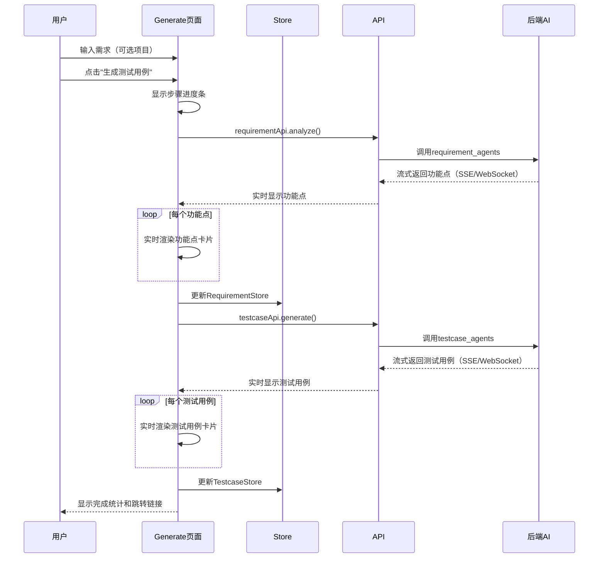

## 产品概述

重构AI用例生成的前端交互流程，简化用户体验，将原本分离的"AI需求分析"和"AI用例生成"菜单合并为一个统一的"AI用例生成"功能模块，采用二级菜单结构组织相关功能。

## 核心功能

### 1. AI用例生成主流程简化

- **简化输入方式**：
- 方式一：手动输入需求描述（必填：需求名称+需求描述；可选：项目名称）
- 方式二：上传需求文档（文档上传；可选：项目名称）
- **去除版本选择**：需求分析和用例生成不再强制选择版本
- **自动化流程**：输入需求 → AI需求分析 → 功能点提取 → 自动生成测试用例
- **流式输出**：实时显示AI分析过程，流式渲染功能点和测试用例内容（参考豆包回答效果），支持导出Excel
- **保留手动控制**：功能点列表支持用户勾选部分功能点手动生成测试用例

### 2. 二级菜单结构

- **AI用例生成**（主菜单）
- 用例生成（默认首页）：输入需求/上传文档，自动生成测试用例
- 功能点管理：查看、编辑、删除功能点，支持勾选生成测试用例
- 测试用例管理：查看、编辑、删除测试用例
- 任务记录：查看AI生成任务历史，支持重试失败任务

### 3. 保留功能

- 项目管理：保留独立页面
- 版本管理：保留独立页面，仅在测试计划中使用
- 测试计划：保留独立页面，关联已生成的测试用例
- 测试报告：保留独立页面

### 4. 数据模型调整

- 需求、功能点、测试用例的version_id字段已支持可选（后端API无需修改）
- 测试计划保持与版本的强关联

## 核心约束

**重要**：本次重构仅涉及前端UI和交互，AI核心逻辑和流程完全不变：

- ✅ 前端UI布局和交互调整
- ✅ 菜单结构和路由重构
- ✅ 输入方式简化
- ❌ AI Agent逻辑不变（requirement_agents, testcase_agents）
- ❌ 功能点生成逻辑不变
- ❌ 测试用例生成逻辑不变
- ❌ AI评审流程不变
- ❌ 向量数据库存储逻辑不变
- ❌ RAG增强检索逻辑不变
- ❌ 后端API无需修改（version_id已支持Optional）

## 技术栈

- **前端框架**：Vue 3 + TypeScript + Vite
- **组件库**：Element Plus + Tailwind CSS
- **状态管理**：Pinia（复用现有Store）
- **路由**：Vue Router（改为嵌套路由）
- **后端**：FastAPI（无需修改，version_id已支持Optional）
- **AI Agent**：现有requirement_agents和testcase_agents（完全不变）

## 实现方案

### 1. 路由结构重构（前端）

**核心改动**：创建嵌套路由，实现二级菜单结构

```typescript
// frontend/src/router/index.ts
{
  path: '/ai-cases',
  name: 'AICaseGeneration',
  component: () => import('@/views/AICaseGeneration/index.vue'),
  meta: { title: 'AI用例生成' },
  redirect: '/ai-cases/generate',
  children: [
    {
      path: 'generate',
      name: 'AICaseGenerate',
      component: () => import('@/views/AICaseGeneration/Generate.vue'),
      meta: { title: '用例生成' }
    },
    {
      path: 'function-points',
      name: 'AICaseFunctionPoints',
      component: () => import('@/views/AICaseGeneration/FunctionPoints.vue'),
      meta: { title: '功能点管理' }
    },
    {
      path: 'test-cases',
      name: 'AICaseTestCases',
      component: () => import('@/views/AICaseGeneration/TestCases.vue'),
      meta: { title: '测试用例管理' }
    },
    {
      path: 'task-records',
      name: 'AICaseTaskRecords',
      component: () => import('@/views/AICaseGeneration/TaskRecords.vue'),
      meta: { title: '任务记录' }
    }
  ]
}
```

**旧路由重定向**（兼容历史书签）：

```typescript
{ path: '/requirements/analysis', redirect: '/ai-cases/generate' }
{ path: '/testcases/generate', redirect: '/ai-cases/generate' }
{ path: '/requirements', redirect: '/ai-cases/function-points' }
{ path: '/testcases', redirect: '/ai-cases/test-cases' }
{ path: '/ai-tasks', redirect: '/ai-cases/task-records' }
```

### 2. 菜单组件重构（前端）

**核心改动**：Layout.vue支持二级菜单显示

**方案**：当菜单项有children时，展开显示二级菜单

```typescript
// frontend/src/components/Layout.vue
const menuItems = [
  { path: '/projects', name: '项目管理', icon: Folder },
  { 
    path: '/ai-cases', 
    name: 'AI用例生成', 
    icon: Sparkles,
    children: [
      { path: '/ai-cases/generate', name: '用例生成' },
      { path: '/ai-cases/function-points', name: '功能点管理' },
      { path: '/ai-cases/test-cases', name: '测试用例管理' },
      { path: '/ai-cases/task-records', name: '任务记录' }
    ]
  },
  { path: '/versions', name: '版本管理', icon: GitBranch },
  { path: '/testplans', name: '测试计划', icon: ClipboardList },
  { path: '/testreports', name: '测试报告', icon: FileBarChart },
]
```

### 3. 组件迁移策略（前端）

**核心原则**：最大程度复用现有组件逻辑

#### Generate.vue（用例生成页面）

**来源**：重构自`RequirementAnalysis.vue`

**主要改动**：

- 去除版本选择（version_id改为可选）
- 简化输入方式（两种模式：手动输入/文档上传）
- 保留现有AI分析流程
- 复用现有的`requirementApi.analyze()`接口
- 复用现有的`Terminal`组件显示分析过程

**数据流**：

```
用户输入 → requirementApi.analyze() 
→ AI分析（后端requirement_agents，不变） 
→ 流式返回功能点（SSE/WebSocket）
→ 实时渲染功能点卡片
→ 自动调用testcaseApi.generate() 
→ AI生成用例（后端testcase_agents，不变）
→ 流式返回测试用例（SSE/WebSocket）
→ 实时渲染测试用例卡片
```

**流式输出实现**：

- 使用EventSource（SSE）或WebSocket接收流式数据
- **功能点流式渲染（参考豆包回答效果）**：
- 每提取一个功能点，创建卡片容器
- 功能点内容逐字或逐句流式显示（类似打字机效果）
- 用户可以实时看到内容生成过程
- 卡片内容：功能点名称、描述、优先级、分类
- 卡片使用淡入动画效果
- **测试用例流式渲染（参考豆包回答效果）**：
- 每生成一个测试用例，创建卡片容器
- 测试用例内容逐字或逐句流式显示（类似打字机效果）
- 用户可以实时看到内容生成过程
- 卡片内容：用例标题、步骤、预期结果、优先级
- 卡片使用淡入动画效果
- 显示步骤进度条：需求分析（step 1）→ 功能点提取（step 2）→ 测试用例生成（step 3）
- 支持导出Excel功能
- **删除WebSocket日志输出模块**（已被进度条和流式卡片替代）

#### FunctionPoints.vue（功能点管理页面）

**来源**：复用`RequirementList.vue`

**主要改动**：

- 添加勾选功能（支持批量生成用例）
- 去除版本筛选
- 保留现有的编辑、删除功能
- 复用现有的`requirementApi`和`useRequirementStore`

#### TestCases.vue（测试用例管理页面）

**来源**：复用`TestCaseList.vue`

**主要改动**：

- 去除版本筛选
- 保留现有的编辑、删除、导出功能
- 复用现有的`testcaseApi`和`useTestcaseStore`

#### TaskRecords.vue（任务记录页面）

**来源**：复用`AITaskRecords.vue`

**主要改动**：

- 无需改动，直接复用

### 4. 状态管理（前端）

**核心原则**：复用现有Store，无需新增Store

- ✅ `useRequirementStore`：管理功能点状态
- ✅ `useTestcaseStore`：管理测试用例状态
- ✅ `useProjectStore`：管理项目状态
- ❌ 无需新增`aiWorkflowStore`（简化方案，避免过度设计）

### 5. API调用策略（前端）

**核心原则**：复用现有API，参数可选化

```typescript
// 手动输入需求分析
await requirementApi.analyze({
  project_id: selectedProjectId.value || undefined,  // 可选
  version_id: undefined,  // 不传
  requirement_name: requirementName.value,
  description: requirementDescription.value
})

// 上传文档分析
await requirementApi.analyzeDocument({
  project_id: selectedProjectId.value || undefined,  // 可选
  version_id: undefined,  // 不传
  file: uploadedFile.value
})

// 功能点生成测试用例
await testcaseApi.generate({
  requirement_ids: selectedRequirementIds.value,
  project_id: selectedProjectId.value || undefined,  // 可选
  version_id: undefined  // 不传
})
```

### 6. 后端API（无需修改）

**核心发现**：后端API中`version_id`已经是`Optional`，无需修改

```python
# backend/app/api/requirements.py
async def analyze_requirement(
    project_id: Optional[int] = Form(None),  # 已支持Optional
    version_id: Optional[int] = Form(None),  # 已支持Optional
    requirement_name: str = Form(...),
    description: str = Form("")
):
    # AI分析逻辑完全不变
```

## 架构设计

### 系统架构图

```mermaid
graph TB
    subgraph 前端UI层
        Layout[Layout布局]
        AIMenu[AI用例生成二级菜单]
        Generate[用例生成页面]
        FunctionPoints[功能点管理]
        TestCases[测试用例管理]
        TaskRecords[任务记录]
        
        Layout --> AIMenu
        AIMenu --> Generate
        AIMenu --> FunctionPoints
        AIMenu --> TestCases
        AIMenu --> TaskRecords
    end
    
    subgraph 状态管理层（复用）
        ProjectStore[项目状态]
        RequirementStore[功能点状态]
        TestcaseStore[测试用例状态]
    end
    
    subgraph API调用层（复用）
        RequirementAPI[功能点API]
        TestcaseAPI[测试用例API]
    end
    
    subgraph 后端服务层（不变）
        AIAgents[AI Agent逻辑]
        VectorDB[向量数据库]
        RAG[RAG增强检索]
    end
    
    Generate --> RequirementStore
    Generate --> TestcaseStore
    FunctionPoints --> RequirementStore
    TestCases --> TestcaseStore
    
    RequirementStore --> RequirementAPI
    TestcaseStore --> TestcaseAPI
    
    RequirementAPI --> AIAgents
    TestcaseAPI --> AIAgents
    AIAgents --> VectorDB
    AIAgents --> RAG
```

### 数据流程图（前端视角）



## 目录结构

### 新增文件

```
frontend/src/views/AICaseGeneration/
├── index.vue                    # [NEW] AI用例生成主容器（二级菜单布局）
├── Generate.vue                 # [NEW] 用例生成页面（简化输入方式）
├── FunctionPoints.vue           # [NEW] 功能点管理页面（复用RequirementList逻辑）
├── TestCases.vue                # [NEW] 测试用例管理页面（复用TestCaseList逻辑）
└── TaskRecords.vue              # [NEW] 任务记录页面（复用AITaskRecords逻辑）
```

### 修改文件

```
frontend/src/router/index.ts     # [MODIFY] 创建嵌套路由，添加旧路由重定向
frontend/src/components/Layout.vue  # [MODIFY] 菜单配置支持二级菜单
```

### 可删除文件（重构完成后）

```
frontend/src/views/RequirementAnalysis.vue  # 功能已迁移到Generate.vue
frontend/src/views/TestCaseGenerate.vue     # 功能已迁移到Generate.vue
frontend/src/views/RequirementList.vue      # 功能已迁移到FunctionPoints.vue
frontend/src/views/TestCaseList.vue         # 功能已迁移到TestCases.vue
frontend/src/views/AITaskRecords.vue        # 功能已迁移到TaskRecords.vue
```

### 无需修改的文件

```
backend/app/api/requirements.py  # version_id已支持Optional
backend/app/api/testcases.py     # version_id已支持Optional
backend/app/agents/requirement_agents.py  # AI逻辑完全不变
backend/app/agents/testcase_agents.py     # AI逻辑完全不变
frontend/src/stores/requirement.ts  # Store逻辑不变
frontend/src/stores/testcase.ts     # Store逻辑不变
frontend/src/api/requirement.ts     # API调用不变
frontend/src/api/testcase.ts        # API调用不变
```

## 实现注意事项

### 性能考虑

- 前端使用虚拟滚动处理大量功能点/测试用例列表
- 添加生成任务进度反馈（复用现有Terminal组件）
- 避免不必要的组件重新渲染
- 流式输出时使用防抖优化，避免过于频繁的UI更新

### 流式输出处理

- 使用EventSource（SSE）或WebSocket接收后端流式数据
- **流式渲染效果（参考豆包回答）**：
- 每个功能点/测试用例生成后立即创建卡片容器
- 内容逐字或逐句流式显示，类似打字机效果
- 用户可以实时看到内容逐步生成
- 卡片使用淡入动画效果，提升视觉体验
- Terminal组件可选显示AI分析日志
- 步骤进度条显示当前执行阶段
- 支持中断正在进行的生成任务
- 使用防抖优化，避免过于频繁的UI更新

### Excel导出功能

- 使用前端库（如xlsx或exceljs）实现导出
- 支持导出功能点列表到Excel
- 支持导出测试用例列表到Excel
- 导出文件包含完整信息：名称、描述、步骤、优先级等
- 导出文件命名格式：功能点_项目名称_日期.xlsx

### 向后兼容

- 保留旧路由301重定向到新路由
- 现有的项目/版本管理页面保持不变
- 测试计划关联测试用例的逻辑不变

### 用户体验优化

- 项目选择改为可选，降低操作门槛
- 自动生成测试用例，减少用户操作步骤
- 功能点列表支持勾选，保留手动控制

## 设计风格

采用现代简约风格，注重功能性和用户效率。使用清晰的视觉层次和一致的交互模式，降低用户学习成本。

## 页面规划

### 1. AI用例生成主容器（index.vue）

**布局结构**：

- 顶部：二级菜单导航栏（用例生成 | 功能点管理 | 测试用例管理 | 任务记录）
- 主体：嵌套路由视图区域

### 2. 用例生成页面（Generate.vue）

**区块设计**：

- **输入方式选择区**：Tab切换（手动输入 / 文档上传）
- **手动输入区**：
- 需求名称输入框（必填）
- 需求描述文本域（必填）
- 项目选择下拉框（可选）
- **文档上传区**：
- 拖拽上传区域
- 项目选择下拉框（可选）
- **操作按钮区**：生成测试用例按钮（带加载状态）
- **生成过程区**：
- 步骤进度条：需求分析 → 功能点提取 → 测试用例生成
- Terminal组件显示AI分析日志（可选显示）
- **功能点实时展示区（参考豆包流式回答效果）**：
    - 流式渲染功能点卡片（每提取一个立即显示）
    - 内容逐字/逐句流式显示，类似打字机效果
    - 卡片内容：功能点名称、描述、优先级、分类
    - 支持展开查看详情
    - 卡片使用淡入动画
- **测试用例实时展示区（参考豆包流式回答效果）**：
    - 流式渲染测试用例卡片（每生成一个立即显示）
    - 内容逐字/逐句流式显示，类似打字机效果
    - 卡片内容：用例标题、步骤、预期结果、优先级
    - 支持展开查看详情
    - 卡片使用淡入动画
- **生成结果预览区**：
- 显示功能点和测试用例数量统计
- 提供"导出Excel"按钮
- 提供跳转到管理页面的链接

### 3. 功能点管理页面（FunctionPoints.vue）

**区块设计**：

- **筛选工具栏**：项目筛选、分类筛选、优先级筛选、搜索框
- **批量操作栏**：勾选功能点、一键生成测试用例按钮、批量删除按钮
- **功能点列表**：表格展示（复选框、功能点名称、所属项目、分类/优先级、测试用例数量、操作按钮）
- **分页组件**

### 4. 测试用例管理页面（TestCases.vue）

**区块设计**：

- **筛选工具栏**：项目筛选、优先级筛选、状态筛选、搜索框
- **批量操作栏**：批量删除、导出功能
- **测试用例列表**：表格展示（用例标题、关联功能点、所属项目、优先级/状态、创建时间、操作按钮）
- **分页组件**

### 5. 任务记录页面（TaskRecords.vue）

**区块设计**：

- **筛选工具栏**：任务类型筛选、状态筛选、时间范围筛选
- **任务列表**：表格展示（任务ID、任务类型、状态、创建时间、完成时间、操作按钮）

## Agent Extensions

### SubAgent

- **code-explorer**
- Purpose: 深入探索现有组件代码结构，确保正确复用逻辑
- Expected outcome: 精确识别RequirementAnalysis.vue、TestCaseGenerate.vue、RequirementList.vue、TestCaseList.vue、AITaskRecords.vue中的可复用代码片段