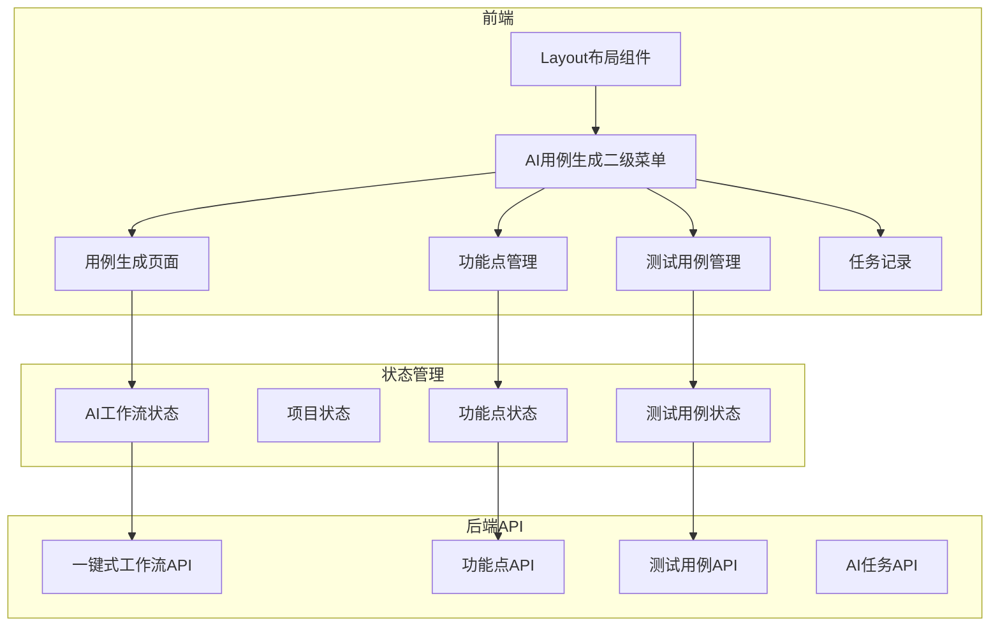
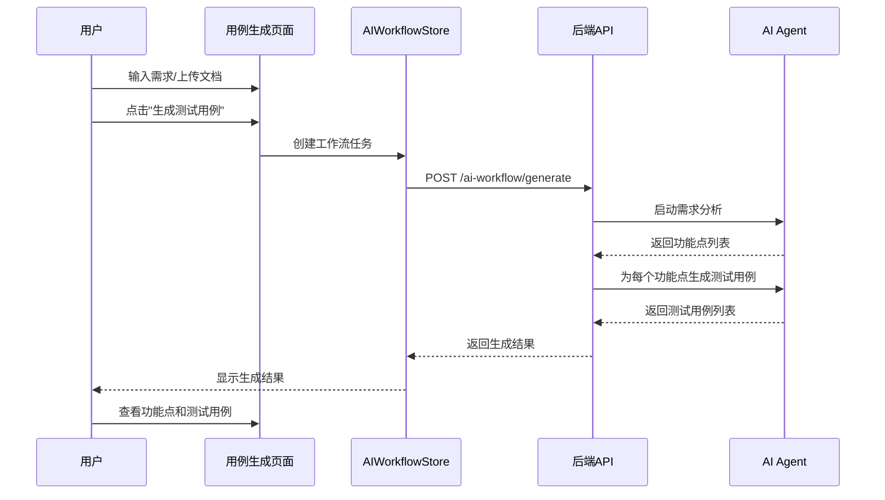

## 产品概述

重构AI用例生成的交互流程，简化用户体验，将原本分离的"AI需求分析"和"AI用例生成"合并为一个统一的"AI用例生成"功能模块，并采用二级菜单结构组织相关功能。

## 核心功能

### 1. AI用例生成主流程

- **简化输入方式**：
- 方式一：手动输入需求描述（必填：需求名称+需求描述；可选：项目名称）
- 方式二：上传需求文档（文档上传；可选：项目名称）
- **去除版本选择**：需求分析和用例生成不再强制选择版本
- **自动化流程**：输入需求 → AI需求分析 → 功能点提取 → 自动生成测试用例
- **保留手动控制**：功能点列表支持用户勾选部分功能点手动生成测试用例

### 2. 二级菜单结构

- **AI用例生成**（主菜单）
- 用例生成（默认首页）：输入需求/上传文档，自动生成测试用例
- 功能点管理：查看、编辑、删除功能点，支持勾选生成测试用例
- 测试用例管理：查看、编辑、删除测试用例
- 任务记录：查看AI生成任务历史，支持重试失败任务

### 3. 保留功能

- 项目管理：保留独立页面
- 版本管理：保留独立页面，仅在测试计划中使用
- 测试计划：保留独立页面，关联已生成的测试用例
- 测试报告：保留独立页面

### 4. 数据模型调整

- 需求、功能点、测试用例的version_id字段改为可选（已在现有模型中支持）
- 测试计划保持与版本的强关联

## 技术栈

- 前端框架：Vue 3 + TypeScript + Vite
- 组件库：Element Plus + Tailwind CSS
- 状态管理：Pinia
- 后端框架：FastAPI + Tortoise ORM
- AI Agent：现有 requirement_agents 和 testcase_agents

## 技术架构

### 系统架构图



### 数据流程图



## 实现方案

### 1. 路由结构重构

**嵌套路由设计**：

```typescript
{
  path: '/ai-cases',
  name: 'AICaseGeneration',
  component: () => import('@/views/AICaseGeneration/index.vue'),
  meta: { title: 'AI用例生成' },
  redirect: '/ai-cases/generate',
  children: [
    {
      path: 'generate',
      name: 'AICaseGenerate',
      component: () => import('@/views/AICaseGeneration/Generate.vue'),
      meta: { title: '用例生成' }
    },
    {
      path: 'function-points',
      name: 'FunctionPoints',
      component: () => import('@/views/AICaseGeneration/FunctionPoints.vue'),
      meta: { title: '功能点管理' }
    },
    {
      path: 'test-cases',
      name: 'TestCases',
      component: () => import('@/views/AICaseGeneration/TestCases.vue'),
      meta: { title: '测试用例管理' }
    },
    {
      path: 'task-records',
      name: 'AITaskRecords',
      component: () => import('@/views/AICaseGeneration/TaskRecords.vue'),
      meta: { title: '任务记录' }
    }
  ]
}
```

### 2. 菜单组件重构

**二级菜单实现**：

- 左侧主菜单显示"AI用例生成"
- 点击后在右侧显示二级菜单栏
- 使用Vue Router的嵌套路由实现菜单高亮

### 3. AI工作流状态管理

**新增Store**：`frontend/src/stores/aiWorkflow.ts`

- 管理当前的生成任务状态
- 缓存最近生成的功能点和测试用例
- 支持跨页面数据共享

### 4. 后端API优化

**新增一键式API**：

```python
@router.post("/ai-workflow/generate")
async def generate_test_cases_from_requirement(
    requirement_name: str,
    requirement_description: str,
    project_id: Optional[int] = None,
    document: Optional[UploadFile] = None
):
    """
    一键式生成测试用例
    1. 分析需求（手动输入或文档）
    2. 提取功能点
    3. 自动为所有功能点生成测试用例
    """
```

**调整现有API**：

- requirements API：version_id 改为可选参数
- testcases API：version_id 改为可选参数

### 5. 性能优化

- **批量生成**：使用异步任务队列处理批量用例生成
- **进度反馈**：通过WebSocket实时推送生成进度
- **增量更新**：功能点列表支持局部刷新，避免全量加载

## 实现注意事项

### 性能考虑

- 大批量功能点生成时，使用分批次处理（每批10个功能点）
- 添加生成任务取消功能，避免长时间占用资源
- 前端使用虚拟滚动处理大量功能点/测试用例列表

### 数据迁移

- 现有数据的version_id字段已支持null，无需数据迁移
- 保留旧路由301重定向到新路由，兼容历史书签

### 向后兼容

- 保留原有的API接口，仅调整参数可选性
- 现有的项目/版本管理页面保持不变

## 目录结构

### 新增文件

```
frontend/src/views/AICaseGeneration/
├── index.vue                    # [NEW] AI用例生成主容器（二级菜单布局）
├── Generate.vue                 # [NEW] 用例生成页面（手动输入/上传文档）
├── FunctionPoints.vue           # [NEW] 功能点管理页面
├── TestCases.vue                # [NEW] 测试用例管理页面
└── TaskRecords.vue              # [NEW] 任务记录页面

frontend/src/stores/
└── aiWorkflow.ts                # [NEW] AI工作流状态管理

frontend/src/api/
└── aiWorkflow.ts                # [NEW] AI工作流API

backend/app/api/
└── ai_workflow.py               # [NEW] 一键式AI工作流API
```

### 修改文件

```
frontend/src/router/index.ts     # [MODIFY] 调整为嵌套路由结构
frontend/src/components/Layout.vue  # [MODIFY] 调整菜单配置为二级菜单
frontend/src/types/requirement.ts   # [MODIFY] version_id明确标记为可选
frontend/src/types/testcase.ts      # [MODIFY] version_id明确标记为可选

backend/app/api/requirements.py  # [MODIFY] version_id参数改为可选
backend/app/api/testcases.py     # [MODIFY] version_id参数改为可选
```

### 可删除文件（重构完成后）

```
frontend/src/views/RequirementAnalysis.vue  # 功能已合并到新页面
frontend/src/views/TestCaseGenerate.vue     # 功能已合并到新页面
frontend/src/views/RequirementList.vue      # 功能已合并到FunctionPoints.vue
frontend/src/views/TestCaseList.vue         # 功能已合并到TestCases.vue
frontend/src/views/AITaskRecords.vue        # 功能已合并到TaskRecords.vue
```

## 设计风格

采用现代简约风格，注重功能性和用户效率。使用清晰的视觉层次和一致的交互模式，降低用户学习成本。

## 页面规划

### 1. AI用例生成主容器（index.vue）

**布局结构**：

- 顶部：二级菜单导航栏（用例生成 | 功能点管理 | 测试用例管理 | 任务记录）
- 主体：嵌套路由视图区域

### 2. 用例生成页面（Generate.vue）

**区块设计**：

- **输入方式选择区**：卡片式切换（手动输入 / 文档上传）
- **手动输入区**：
- 需求名称输入框（必填）
- 需求描述文本域（必填）
- 项目选择下拉框（可选）
- **文档上传区**：
- 拖拽上传区域
- 项目选择下拉框（可选）
- **操作按钮区**：生成测试用例按钮（带加载状态）
- **生成结果预览区**：显示功能点和测试用例数量统计

### 3. 功能点管理页面（FunctionPoints.vue）

**区块设计**：

- **筛选工具栏**：项目筛选、分类筛选、优先级筛选、搜索框
- **批量操作栏**：勾选功能点、一键生成测试用例按钮、批量删除按钮
- **功能点列表**：
- 复选框列
- 功能点名称
- 所属项目
- 分类/优先级
- 测试用例数量
- 操作按钮（查看、编辑、删除）
- **分页组件**

### 4. 测试用例管理页面（TestCases.vue）

**区块设计**：

- **筛选工具栏**：项目筛选、优先级筛选、状态筛选、搜索框
- **批量操作栏**：批量删除、导出功能
- **测试用例列表**：
- 用例标题
- 关联功能点
- 所属项目
- 优先级/状态
- 创建时间
- 操作按钮（查看、编辑、删除）
- **分页组件**

### 5. 任务记录页面（TaskRecords.vue）

**区块设计**：

- **筛选工具栏**：任务类型筛选、状态筛选、时间范围筛选
- **任务列表**：
- 任务ID
- 任务类型（需求分析/用例生成）
- 状态（进行中/成功/失败）
- 创建时间
- 完成时间
- 操作按钮（查看详情、重试、查看结果）