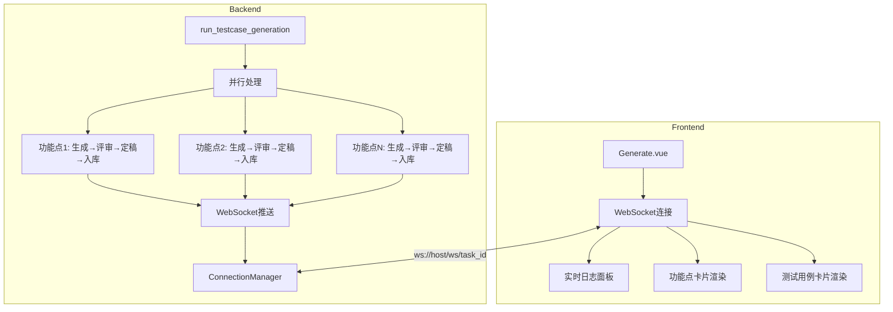

## 用户需求

优化AI用例生成的性能和用户体验：

1. **速度太慢**：简单需求的需求分析+提取功能点+用例生成超过10分钟
2. **不是流式输出**：功能点和用例生成是全部完成后一次性打印输出，用户无法看到实时进度
3. **核心要求**：并行处理功能点，保留现有Agent流程（生成→评审→定稿→入库）

## 产品概述

在AI用例生成过程中，实现实时流式输出和并行处理优化，提升用户体验和生成速度。

## 核心功能

- 前端实现WebSocket连接，实时接收后端推送的流式内容
- 后端并行处理多个功能点的测试用例生成
- 实时显示Agent工作进度和生成结果
- 保留现有4个Agent流程：生成→评审→定稿→入库

## Tech Stack Selection

- **前端框架**: Vue 3.5.0 + TypeScript 5.6.0
- **状态管理**: Pinia 2.2.0
- **HTTP客户端**: Axios 1.7.0
- **UI组件**: Element Plus 2.8.0 + Tailwind CSS 3.4.17
- **后端框架**: FastAPI
- **Agent框架**: AutoGen 0.7.5
- **实时通信**: WebSocket

## Implementation Approach

### 核心问题

1. **前端未使用WebSocket**：后端已实现WebSocket推送（`/ws/{task_id}`），但前端只使用HTTP轮询（每2秒查询一次）
2. **功能点串行处理**：代码中 `for idx, req_id in enumerate(requirement_ids)` 是逐个串行处理

### 解决方案

**阶段一：前端WebSocket连接（解决流式输出问题）**

1. 创建WebSocket服务封装（`frontend/src/api/websocket.ts`）
2. 在 `Generate.vue` 中建立WebSocket连接
3. 实时接收Agent消息并显示

**阶段二：后端并行处理优化**

1. 修改 `run_testcase_generation` 函数
2. 将串行的 `for` 循环改为并行处理
3. 使用 `asyncio.gather()` 同时处理多个功能点
4. 保留现有4个Agent流程

### 性能优化细节

**并行处理实现**：

```python
# 当前（串行）
for idx, req_id in enumerate(requirement_ids):
    await process_requirement(req_id)

# 优化后（并行）
async def process_requirement(req_id, task_id, ...):
    # 完整流程：生成 → 评审 → 定稿 → 入库
    ...

await asyncio.gather(*[
    process_requirement(req_id, task_id, ...) 
    for req_id in requirement_ids
])
```

**预期效果**：5个功能点从串行9分钟降到并行2分钟

## Implementation Notes

- WebSocket端点：`ws://host/ws/{task_id}`（路由注册在第87行 `app.include_router(websocket.router, prefix="/ws")`）
- 消息格式：`{"type": "thinking/response/error/complete", "agent": "Agent名称", "content": "内容", "timestamp": "时间"}`
- 前端使用 `api` 目录存放API相关代码，没有 `services` 目录
- 需要处理WebSocket心跳检测和自动重连
- 并行处理时需要确保每个功能点的task_id独立，避免WebSocket消息混淆

## Architecture Design



## Directory Structure

```
frontend/src/
├── api/
│   ├── index.ts              # Axios实例（已存在）
│   └── websocket.ts          # [NEW] WebSocket服务封装
└── views/AICaseGeneration/
    └── Generate.vue          # [MODIFY] 添加WebSocket连接和实时渲染

backend/app/
├── agents/
│   └── testcase_agents.py    # [MODIFY] 并行处理功能点
├── api/
│   └── websocket.py          # 保持不变，消息推送机制已完善
└── main.py                   # WebSocket路由已注册
```

## Key Code Structures

### WebSocket服务接口定义

```typescript
// frontend/src/api/websocket.ts
interface WebSocketMessage {
  type: 'thinking' | 'response' | 'error' | 'complete' | 'streaming'
  agent: string
  agent_code: string
  content: string
  timestamp: string
  data?: any
}

interface WebSocketCallbacks {
  onMessage: (message: WebSocketMessage) => void
  onError: (error: Event) => void
  onClose: () => void
}

class WebSocketService {
  connect(taskId: string, callbacks: WebSocketCallbacks): void
  disconnect(): void
  sendHeartbeat(): void
}
```

### 并行处理函数签名

```python
# backend/app/agents/testcase_agents.py
async def _process_single_requirement(
    req_id: int,
    task_id: str,
    project_id: Optional[int],
    version_id: Optional[int],
    generate_client,
    review_client,
    gen_model_name: str,
    task_record,  # TestCaseGenerationTask
    idx: int,
    total: int,
) -> List[int]:
    """
    处理单个功能点的完整流程：生成 → 评审 → 定稿 → 入库
    返回保存的测试用例ID列表
    """
```

## Agent Extensions

### SubAgent

- **code-explorer**: 已完成探索，确认了实际代码架构和WebSocket端点你