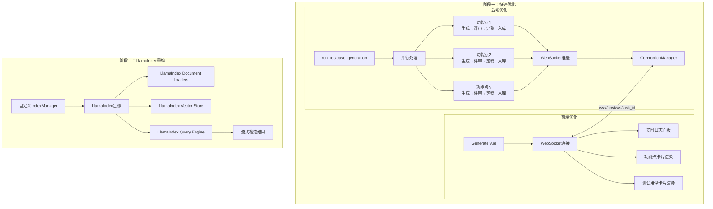

## 用户需求

优化AI用例生成的性能和用户体验，解决以下问题：

1. **速度太慢**：简单需求的需求分析+提取功能点+用例生成超过10分钟
2. **不是流式输出**：功能点和用例生成是全部完成后一次性打印输出，用户无法看到实时进度

## 产品概述

在AI用例生成过程中，实现实时流式输出和并行处理优化，采用混合方案：先快速优化解决当前问题，后续规划LlamaIndex重构满足更复杂需求。

## 核心功能

**阶段一：功能点级并行优化（4小时完成）**

- 前端实现WebSocket连接，实时接收后端推送的流式内容
- 后端并行处理多个功能点的测试用例生成
- 实时显示Agent工作进度和生成结果
- 保留现有4个Agent流程：生成→评审→定稿→入库

**阶段二：文档级并行优化（2小时完成）**

- 前端支持多文档批量上传
- 后端并行处理多个需求文档的需求分析
- 合并所有功能点，统一并行生成测试用例
- 实时显示所有文档的处理进度

**阶段三：LlamaIndex重构（未来规划）**

- RAG框架升级，支持更复杂的检索策略
- 流式输出增强，更细粒度的实时控制
- 渐进式迁移，不影响现有功能

## Tech Stack Selection

### 阶段一：功能点级并行优化

- **前端框架**: Vue 3.5.0 + TypeScript 5.6.0
- **状态管理**: Pinia 2.2.0
- **HTTP客户端**: Axios 1.7.0
- **UI组件**: Element Plus 2.8.0 + Tailwind CSS 3.4.17
- **后端框架**: FastAPI
- **Agent框架**: AutoGen 0.7.5
- **实时通信**: WebSocket
- **RAG**: 自定义IndexManager + Milvus

### 阶段二：文档级并行优化

- **前端框架**: Vue 3.5.0 + TypeScript 5.6.0
- **文件上传**: 支持多文件选择和批量上传
- **后端框架**: FastAPI + asyncio.gather()
- **并发控制**: asyncio并发处理多个文档

### 阶段三：LlamaIndex重构

- **RAG框架**: LlamaIndex
- **文档解析**: LlamaIndex Document Loaders
- **向量检索**: LlamaIndex Vector Store
- **流式输出**: LlamaIndex StreamingResponse

## Implementation Approach

### 核心问题分析

**当前架构（已通过代码探索确认）**：

1. **前端未使用WebSocket**：后端已实现WebSocket推送（`/ws/{task_id}`），但前端只使用HTTP轮询（每2秒查询一次）
2. **功能点串行处理**：代码中 `for idx, req_id in enumerate(requirement_ids)` 是逐个串行处理
3. **RAG已实现**：`TestCaseGenerateAgent` 中已使用RAG检索增强，使用自定义IndexManager

**后端WebSocket实现（已验证）**：

- 端点：`ws://host/ws/{task_id}`
- 推送函数：`push_agent_message(task_id, agent_name, content, message_type)`
- 消息类型：thinking/response/error/complete/streaming
- 连接管理：`ConnectionManager` 按task_id管理连接

**前端架构（已验证）**：

- 没有WebSocket连接，使用 `setInterval` 每2秒轮询
- API调用从 `frontend/src/api/` 目录导入
- 没有services目录

### 阶段一：快速优化方案

**问题1：流式输出**

- 方案：前端添加WebSocket连接
- 改动：
- 新增 `frontend/src/api/websocket.ts` WebSocket服务封装
- 修改 `frontend/src/views/AICaseGeneration/Generate.vue` 添加WebSocket连接
- 实时接收Agent消息并显示

**问题2：速度慢**

- 方案：并行处理多个功能点
- 改动：
- 修改 `backend/app/agents/testcase_agents.py` 的 `run_testcase_generation` 函数
- 将串行的 `for` 循环改为 `asyncio.gather()` 并行处理
- 每个功能点保留完整流程：生成→评审→定稿→入库
- RAG检索独立进行，不会冲突

**并行处理实现**：

```python
# 当前（串行）
for idx, req_id in enumerate(requirement_ids):
    requirement = await Requirement.get_or_none(id=req_id)
    # 生成用例、评审、定稿、入库
    
# 优化后（并行）
async def _process_single_requirement(req_id, task_id, ...):
    requirement = await Requirement.get_or_none(id=req_id)
    # RAG检索（独立）
    # 生成用例
    # 评审
    # 定稿
    # 入库
    return saved_ids

# 并行执行所有功能点
results = await asyncio.gather(*[
    _process_single_requirement(req_id, task_id, ...)
    for req_id in requirement_ids
])
```

**WebSocket连接实现**：

```typescript
// frontend/src/api/websocket.ts
class WebSocketService {
  private ws: WebSocket | null = null
  private heartbeatInterval: number | null = null
  
  connect(taskId: string, callbacks: WebSocketCallbacks) {
    const wsUrl = `${baseURL}/ws/${taskId}`
    this.ws = new WebSocket(wsUrl)
    
    this.ws.onmessage = (event) => {
      const message: WebSocketMessage = JSON.parse(event.data)
      callbacks.onMessage(message)
    }
    
    // 心跳保活
    this.heartbeatInterval = setInterval(() => {
      this.ws?.send(JSON.stringify({ type: 'ping' }))
    }, 30000)
  }
}
```

### 阶段二：LlamaIndex重构方案（未来规划）

**目标**：

- 更成熟的RAG框架
- 更灵活的检索策略
- 更细粒度的流式控制

**实施策略**：

1. **保留AutoGen Agent框架**：Agent编排机制已经很好用
2. **只替换RAG部分**：将自定义IndexManager迁移到LlamaIndex
3. **渐进式迁移**：

- 第一步：引入LlamaIndex，与现有RAG并存
- 第二步：新功能使用LlamaIndex
- 第三步：逐步迁移现有功能

**技术选型**：

- 文档解析：LlamaIndex Document Loaders（支持PDF、Word、Markdown等）
- 向量存储：LlamaIndex Vector Store（兼容Milvus）
- 检索策略：LlamaIndex Query Engine（支持混合检索、重排序）
- 流式输出：LlamaIndex StreamingResponse + CallbackHandler

### 性能优化细节

**阶段一预期效果**：

- 生成时间：10分钟 → 2-3分钟（提速70-80%）
- 用户体验：实时看到Agent工作过程
- 资源消耗：HTTP轮询 → WebSocket长连接（减少请求开销）

**并行处理注意事项**：

- 每个功能点的RAG检索独立进行
- 向量数据库（Milvus）支持并发查询
- WebSocket推送消息需要包含功能点标识，避免消息混乱

## Implementation Notes

- 后端WebSocket端点已实现：`/ws/{task_id}`
- 后端推送函数已实现：`push_to_websocket(task_id, agent_name, content, message_type)`
- 前端需要处理心跳检测和重连逻辑
- 并行处理时需要推送功能点序号，方便前端区分

## Architecture Design



## Directory Structure

### 阶段一：快速优化

```
frontend/src/
├── api/
│   ├── index.ts              # Axios实例（已存在）
│   └── websocket.ts          # [NEW] WebSocket服务封装
└── views/AICaseGeneration/
    └── Generate.vue          # [MODIFY] 添加WebSocket连接和实时渲染

backend/app/
├── agents/
│   └── testcase_agents.py    # [MODIFY] 并行处理功能点
├── api/
│   └── websocket.py          # 保持不变，消息推送机制已完善
└── main.py                   # WebSocket路由已注册
```

### 阶段二：LlamaIndex重构

```
backend/app/
├── rag/
│   ├── index_manager.py      # [MODIFY] 保留兼容
│   ├── llamaindex_manager.py # [NEW] LlamaIndex管理器
│   └── document_loaders/     # [NEW] 文档加载器
├── agents/
│   └── testcase_agents.py    # [MODIFY] 支持LlamaIndex
└── config.py                 # [MODIFY] 添加LlamaIndex配置
```

## Key Code Structures

### WebSocket服务接口定义

```typescript
// frontend/src/api/websocket.ts
interface WebSocketMessage {
  type: 'thinking' | 'response' | 'error' | 'complete' | 'streaming'
  agent: string
  agent_code: string
  content: string
  timestamp: string
  data?: {
    requirement_id?: number
    requirement_name?: string
    progress?: number
  }
}

interface WebSocketCallbacks {
  onMessage: (message: WebSocketMessage) => void
  onError: (error: Event) => void
  onClose: () => void
}

class WebSocketService {
  connect(taskId: string, callbacks: WebSocketCallbacks): void
  disconnect(): void
  sendHeartbeat(): void
}
```

### 并行处理函数签名

```python
# backend/app/agents/testcase_agents.py
async def _process_single_requirement(
    req_id: int,
    task_id: str,
    project_id: Optional[int],
    version_id: Optional[int],
    generate_client,
    review_client,
    gen_model_name: str,
    task_record,  # TestCaseGenerationTask
    idx: int,
    total: int,
) -> List[int]:
    """
    处理单个功能点的完整流程：生成 → 评审 → 定稿 → 入库
    包含RAG检索增强
    返回保存的测试用例ID列表
    """
```

### SubAgent

- **code-explorer**: 探索项目实际架构和代码实现
- Purpose: 确认WebSocket端点、Agent流程、RAG实现等关键代码
- Expected outcome: 获得准确的代码位置和实现细节，避免基于过时文档制定方案