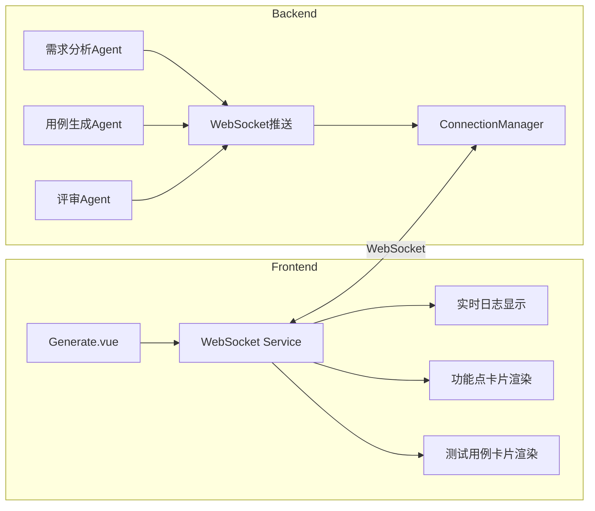

## 用户需求

优化AI用例生成的性能和用户体验，解决以下问题：

1. **速度太慢**：简单需求的需求分析+提取功能点+用例生成超过10分钟
2. **不是流式输出**：功能点和用例生成是全部完成后一次性打印输出，用户无法看到实时进度

## 核心功能

- 前端实现WebSocket连接，实时接收后端推送的流式内容
- 实时显示功能点提取进度和结果
- 实时显示测试用例生成进度和结果
- 优化后端流程，提升生成速度

## Tech Stack

- **前端**: Vue 3 + TypeScript + WebSocket API
- **后端**: FastAPI + WebSocket + AutoGen 0.7.5
- **实时通信**: WebSocket

## Implementation Approach

### 核心问题

后端已实现WebSocket推送和流式输出，但前端没有WebSocket连接，只使用HTTP轮询，导致：

1. 用户无法看到实时进度
2. 任务完成后一次性加载所有数据

### 解决方案

**阶段一：前端WebSocket连接（解决流式输出问题）**

1. 创建WebSocket服务封装
2. 在Generate.vue中建立WebSocket连接
3. 实时显示Agent日志和生成结果

**阶段二：实时数据推送优化**

1. 后端推送功能点生成进度
2. 后端推送测试用例生成进度
3. 前端实时渲染卡片

**阶段三：性能优化**

1. 并行处理多个功能点的测试用例生成
2. 优化Agent流程，减少不必要的步骤
3. 可选的快速模式（跳过评审）

## Implementation Notes

- 后端WebSocket端点：`/ws/{task_id}`
- 后端推送函数：`push_to_websocket(task_id, agent_name, content, message_type)`
- 消息类型：thinking/response/error/complete
- 前端需要处理心跳检测和重连逻辑

## Architecture Design



## Directory Structure

```
frontend/src/
├── services/
│   └── websocket.ts           # [NEW] WebSocket服务封装
├── views/AICaseGeneration/
│   └── Generate.vue           # [MODIFY] 添加WebSocket连接和实时渲染
└── components/
    └── LogPanel.vue           # [NEW] 实时日志面板组件（可选）

backend/app/
├── agents/
│   └── testcase_agents.py     # [MODIFY] 推送生成进度数据
└── api/
    └── websocket.py           # [MODIFY] 扩展消息类型
```

## Agent Extensions

### SubAgent

- **code-explorer**: 探索前端是否有现成的WebSocket实现或类似模式，以及后端Agent推送的具体数据格式
- Purpose: 查找现有的WebSocket使用模式和Agent消息格式
- Expected outcome: 确定前端实现WebSocket的最佳方式，了解后端推送的数据结构