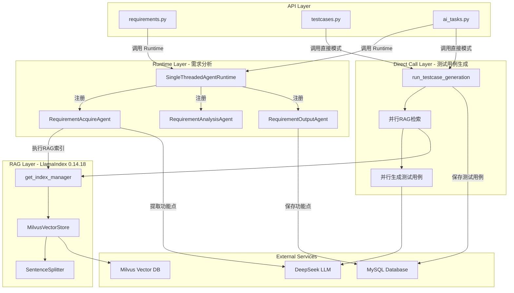
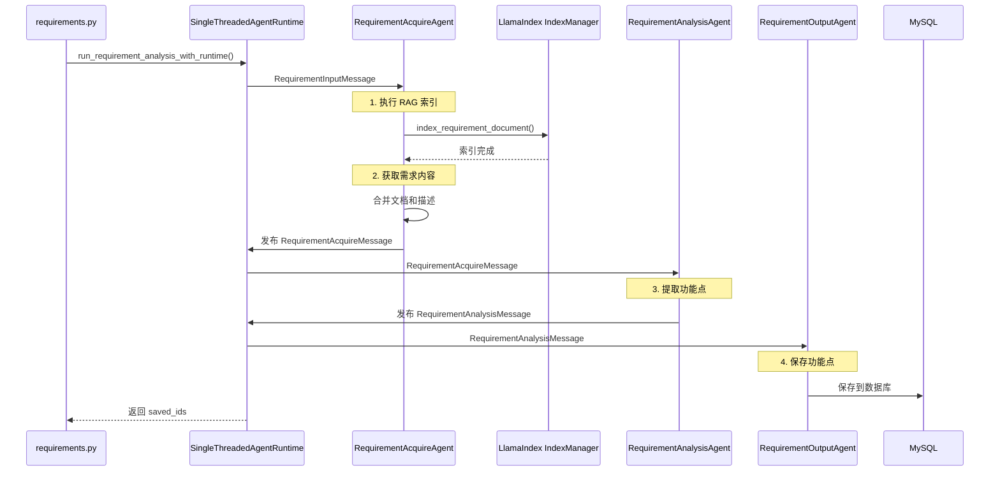

## 用户需求

用户发现日志显示"直接调用模式"，期望使用 AutoGen 0.7.5 的"Runtime模式"，并要求：

1. **确保技术栈版本正确**：LlamaIndex 0.14.18 + AutoGen 0.7.5
2. **保持测试用例生成的并行处理能力**
3. **统一架构标准**：需求分析使用 Runtime 模式

## 产品概述

一个基于 LlamaIndex 0.14.18 + AutoGen 0.7.5 的混合架构系统：

- **需求分析流水线**：Runtime 模式（Agent 协作流程清晰）
- **测试用例生成流水线**：直接调用模式（性能优化，并行处理）

## 核心功能

- **Runtime 模式架构**：需求分析使用 AutoGen 0.7.5 的 SingleThreadedAgentRuntime，消息驱动的 Agent 协作
- **RAG 索引集成**：在 RequirementAcquireAgent 中执行文档向量化，支持有项目和无项目两种情况
- **并行处理优化**：测试用例生成保留完善的并行处理逻辑（RAG 检索并行 + 生成并行）
- **API 端点分离**：需求分析 API 切换到 Runtime 模式，测试用例生成 API 保持直接调用模式

## Tech Stack

- **Backend Framework**: FastAPI 0.115.0
- **Multi-Agent Framework**: AutoGen 0.7.5 (autogen-agentchat, autogen-core, autogen-ext)
- **RAG Framework**: LlamaIndex 0.14.18 (llama-index-core, llama-index-readers-file, llama-index-vector-stores-milvus)
- **Vector Database**: Milvus 2.4.0+
- **Database**: Tortoise ORM + MySQL
- **LLM**: DeepSeek (via OpenAI-compatible API) + Qwen (via DashScope)
- **Logging**: Loguru 0.7.2

## 架构设计原则

### 混合架构方案

**需求分析 → Runtime 模式**：

- ✅ AutoGen 0.7.5 标准架构
- ✅ Agent 协作流程清晰（RequirementAcquireAgent → RequirementAnalysisAgent → RequirementOutputAgent）
- ✅ 适合消息驱动的串行流程

**测试用例生成 → 直接调用模式**：

- ✅ 完善的并行处理逻辑（RAG 检索并行 + 生成并行）
- ✅ asyncio.Semaphore 控制并发（RAG 最多 2 个，生成最多 3 个）
- ✅ asyncio.gather() 批量处理
- ✅ 性能优化：并行 RAG 检索 + 并行生成 + 合并评审

### 关键技术决策

**为什么不统一使用 Runtime 模式？**

AutoGen 0.7.5 的 Runtime 架构适合 Agent 协作流程，但**不适合并行批处理**：

- Runtime 模式的测试用例生成（`run_testcase_generation_with_runtime`）是**串行处理**（第1027-1058行，逐个等待完成）
- 直接调用模式的测试用例生成（`run_testcase_generation`）有**完善的并行处理**（第1068-1550行）

**为什么不删除测试用例生成的直接调用模式？**

这不是代码冗余，而是**性能优化版本**：

- RAG 检索并行：7个功能点同时检索（Semaphore 控制最多2个并发）
- 测试用例生成并行：批量生成（Semaphore 控制最多3个并发）
- 性能提升：串行处理 10分钟 → 并行处理 2-3分钟

### 性能考虑

- **需求分析**：RAG 索引是同步执行的，但在 Runtime 架构下这是合理的
- **测试用例生成**：并行处理，显著提升性能（RAG 检索并行 + 生成并行）
- **文档分块参数**：chunk_size=500, overlap=100，平衡索引质量和性能
- **Milvus 连接复用**：通过 `get_index_manager()` 单例模式复用连接

## Architecture Design

### 系统架构图



### 消息流程



## Directory Structure

```
backend/
├── app/
│   ├── agents/
│   │   ├── requirement_agents.py  # [MODIFY] 增强 RequirementAcquireAgent RAG 索引逻辑，删除需求分析直接调用模式函数
│   │   ├── testcase_agents.py     # [KEEP] 保留直接调用模式（并行处理优化）
│   │   └── runtime.py             # 无需修改
│   ├── api/
│   │   ├── requirements.py        # [MODIFY] 切换到 Runtime 模式（第367行、第378行、第502行、第542行）
│   │   ├── testcases.py           # [KEEP] 保持直接调用模式（第259行）
│   │   └── ai_tasks.py            # [MODIFY] 需求分析切换到 Runtime 模式（第291行），测试用例生成保持直接模式（第376行）
│   ├── rag/
│   │   ├── llamaindex_manager.py  # 无需修改（已支持 project_id + task_id 双标识）
│   │   └── __init__.py            # 无需修改
│   └── models/
│       └── requirement.py         # 无需修改
└── requirements.txt               # 无需修改（已确认版本正确）
```

### 文件改动详情

#### 1. `backend/app/agents/requirement_agents.py` [MODIFY]

**改动1：增强 RequirementAcquireAgent 的 RAG 索引逻辑**

- **位置**：第477-490行
- **改动内容**：补充完整的 RAG 索引逻辑（参考直接调用模式第1055-1103行的实现）
- **功能**：
- 支持 project_id 和 task_id 双标识
- 执行文档分块和向量化
- 推送索引进度日志到前端
- 异常处理：RAG 索引失败不影响主流程

**改动2：删除需求分析直接调用模式函数**

- **位置**：第971-1283行
- **改动内容**：删除 `run_requirement_analysis` 函数（仅删除需求分析的直接调用模式）
- **注意**：保留 `run_testcase_generation` 函数（测试用例生成的并行优化版本）

#### 2. `backend/app/api/requirements.py` [MODIFY]

**改动1：单文档分析 API**

- **位置**：第367行、第378行
- **改动内容**：

```python
# 改前
from app.agents.requirement_agents import run_requirement_analysis
saved_ids = await run_requirement_analysis(...)

# 改后
from app.agents.requirement_agents import run_requirement_analysis_with_runtime
saved_ids = await run_requirement_analysis_with_runtime(...)
```

**改动2：批量分析 API**

- **位置**：第502行、第542行
- **改动内容**：同上，切换到 Runtime 模式

#### 3. `backend/app/api/ai_tasks.py` [MODIFY]

**改动：重试分析 API（仅需求分析部分）**

- **位置**：第291行、第301行（需求分析部分）
- **改动内容**：切换到 Runtime 模式
- **注意**：第376行（测试用例生成部分）保持直接调用模式

#### 4. `backend/app/api/testcases.py` [KEEP]

**保持不变**

- 第259行继续使用 `run_testcase_generation`（并行优化版本）
- 不切换到 Runtime 模式（性能考虑）

## Key Code Structures

### RequirementAcquireAgent RAG 索引逻辑（参考实现）

```python
# backend/app/agents/requirement_agents.py
# RequirementAcquireAgent.handle_message 方法中，第477-490行之间插入

class RequirementAcquireAgent(RoutedAgent):
    async def handle_message(self, message: RequirementInputMessage, ctx: MessageContext):
        task_id = message.task_id
        
        # ========== 新增：RAG 索引步骤 ==========
        if message.document_content or message.description:
            try:
                await push_log(task_id, "RAGIndexAgent", "⏳ 正在创建文档向量索引...", "thinking")
                
                from app.rag import get_index_manager
                index_manager = await get_index_manager()
                
                rag_content = message.document_content if message.document_content else message.description
                index_result = await index_manager.index_requirement_document(
                    project_id=message.project_id,
                    task_id=task_id,  # 支持无项目情况
                    content=rag_content,
                    filename="requirement_document.md",
                    version_id=message.version_id,
                    requirement_name=message.requirement_name,
                    chunk_size=500,
                    overlap=100
                )
                
                if index_result.get("success"):
                    chunk_count = index_result.get('indexed', 0)
                    await push_log(
                        task_id, 
                        "RAGIndexAgent", 
                        f"✅ 文档索引完成：{chunk_count} 个文本块已存入向量数据库", 
                        "response"
                    )
                else:
                    await push_log(
                        task_id, 
                        "RAGIndexAgent", 
                        f"⚠️ 文档索引跳过：{index_result.get('error', '未知错误')}", 
                        "thinking"
                    )
            except Exception as e:
                logger.warning(f"RAG索引失败（不影响需求分析）: {e}")
                await push_log(task_id, "RAGIndexAgent", f"⚠️ RAG索引失败：{e}", "thinking")
        
        # 继续原有的需求获取流程...
```

### Runtime 模式调用方式（需求分析）

```python
# backend/app/api/requirements.py

from app.agents.requirement_agents import run_requirement_analysis_with_runtime

saved_ids = await run_requirement_analysis_with_runtime(
    task_id=task_id,
    project_id=project_id,
    requirement_name=requirement_name,
    document_content=document_content,
    description=description,
    version_id=version_id,
    input_func=input_func,  # 可选：用户输入函数（用于交互式模式）
)
```

### 直接调用模式调用方式（测试用例生成，保持不变）

```python
# backend/app/api/testcases.py

from app.agents.testcase_agents import run_testcase_generation

await run_testcase_generation(
    task_id=task_id,
    project_id=data.project_id,
    requirement_ids=data.requirement_ids,
    version_id=data.version_id,
    llm_config=data.llm_config,
)
```

### SubAgent

- **code-explorer**
- Purpose: 搜索所有引用 `run_requirement_analysis` 的位置（不包括 `run_testcase_generation`），确保需求分析切换到 Runtime 模式
- Expected outcome: 确认需求分析 API 端点都已切换到 Runtime 模式，测试用例生成 API 保持直接调用模式