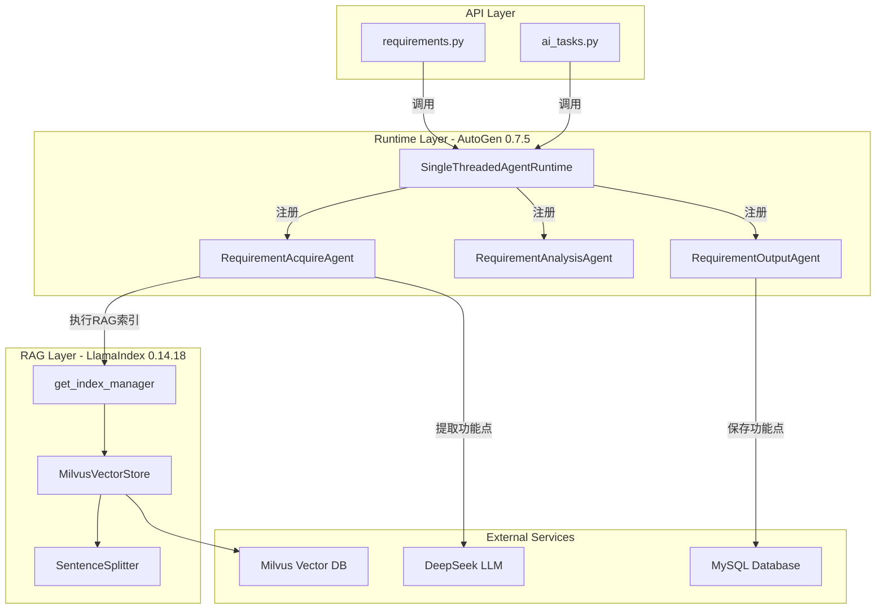
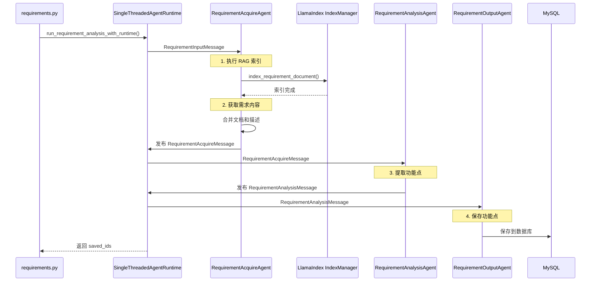

## 用户需求

用户发现日志显示"直接调用模式"，期望使用 AutoGen 0.7.5 的"Runtime模式"，并要求：

1. **确保技术栈版本正确**：LlamaIndex 0.14.18 + AutoGen 0.7.5
2. **彻底删除直接调用模式函数**：`run_requirement_analysis`
3. **只保留 Runtime 模式**：`run_requirement_analysis_with_runtime`

## 产品概述

一个基于 AutoGen 0.7.5 Runtime 架构的需求分析流水线，集成 LlamaIndex 0.14.18 的 RAG 能力，实现：

- 需求文档上传和向量化索引
- 多 Agent 协作提取功能点
- 支持后续测试用例生成的 RAG 检索

## 核心功能

- **Runtime 模式架构**：使用 AutoGen 0.7.5 的 SingleThreadedAgentRuntime，消息驱动的 Agent 协作
- **RAG 索引集成**：在 RequirementAcquireAgent 中执行文档向量化，支持有项目和无项目两种情况
- **彻底删除冗余代码**：删除直接调用模式函数，简化代码架构
- **API 端点统一**：所有需求分析 API 统一使用 Runtime 模式

## Tech Stack

- **Backend Framework**: FastAPI 0.115.0
- **Multi-Agent Framework**: AutoGen 0.7.5 (autogen-agentchat, autogen-core, autogen-ext)
- **RAG Framework**: LlamaIndex 0.14.18 (llama-index-core, llama-index-readers-file, llama-index-vector-stores-milvus)
- **Vector Database**: Milvus 2.4.0+
- **Database**: Tortoise ORM + MySQL
- **LLM**: DeepSeek (via OpenAI-compatible API) + Qwen (via DashScope)
- **Logging**: Loguru 0.7.2

## Implementation Approach

### 架构设计原则

1. **统一使用 Runtime 架构**：删除直接调用模式，简化代码架构，避免维护两套代码
2. **RAG 索引集成到 Agent 内部**：在 RequirementAcquireAgent 中执行文档向量化，而不是在 API 层或外部函数中
3. **保持向后兼容**：支持有项目（project_id）和无项目（task_id）两种情况

### 关键技术决策

**为什么在 Agent 内部执行 RAG 索引？**

- AutoGen 0.7.5 Runtime 是消息驱动的架构，Agent 是最小执行单元
- RAG 索引是需求获取的一部分，应该由 RequirementAcquireAgent 负责
- 避免在 API 层引入额外的异步任务管理复杂度

**为什么删除直接调用模式？**

- 代码冗余：Runtime 模式和直接调用模式功能重复
- 维护成本：需要同步维护两套代码
- 架构不统一：直接调用模式不符合 AutoGen 0.7.5 的最佳实践

### 性能考虑

- RAG 索引是同步执行的，但在 Runtime 架构下这是合理的（Agent 内部串行执行）
- 文档分块参数：chunk_size=500, overlap=100，平衡索引质量和性能
- Milvus 连接复用：通过 `get_index_manager()` 单例模式复用连接

## Architecture Design

### 系统架构图



### 消息流程



## Directory Structure

```
backend/
├── app/
│   ├── agents/
│   │   ├── requirement_agents.py  # [MODIFY] 增强 RequirementAcquireAgent RAG 索引逻辑，删除直接调用模式函数
│   │   ├── testcase_agents.py     # 无需修改
│   │   └── runtime.py             # 无需修改
│   ├── api/
│   │   ├── requirements.py        # [MODIFY] 切换到 Runtime 模式（第367行、第378行、第502行、第542行）
│   │   └── ai_tasks.py            # [MODIFY] 切换到 Runtime 模式（第291行、第301行）
│   ├── rag/
│   │   ├── llamaindex_manager.py  # 无需修改（已支持 project_id + task_id 双标识）
│   │   └── __init__.py            # 无需修改
│   └── models/
│       └── requirement.py         # 无需修改
└── requirements.txt               # 无需修改（已确认版本正确）
```

### 文件改动详情

#### 1. `backend/app/agents/requirement_agents.py` [MODIFY]

**改动1：增强 RequirementAcquireAgent 的 RAG 索引逻辑**

- **位置**：第477-490行
- **改动内容**：补充完整的 RAG 索引逻辑（参考直接调用模式第1055-1103行的实现）
- **功能**：
- 支持 project_id 和 task_id 双标识
- 执行文档分块和向量化
- 推送索引进度日志到前端
- 异常处理：RAG 索引失败不影响主流程

**改动2：删除直接调用模式函数**

- **位置**：第971-1283行
- **改动内容**：删除整个 `run_requirement_analysis` 函数
- **原因**：代码冗余，Runtime 模式是唯一标准

#### 2. `backend/app/api/requirements.py` [MODIFY]

**改动1：单文档分析 API**

- **位置**：第367行、第378行
- **改动内容**：

```python
# 改前
from app.agents.requirement_agents import run_requirement_analysis
saved_ids = await run_requirement_analysis(...)

# 改后
from app.agents.requirement_agents import run_requirement_analysis_with_runtime
saved_ids = await run_requirement_analysis_with_runtime(...)
```

**改动2：批量分析 API**

- **位置**：第502行、第542行
- **改动内容**：同上，切换到 Runtime 模式

#### 3. `backend/app/api/ai_tasks.py` [MODIFY]

**改动：重试分析 API**

- **位置**：第291行、第301行
- **改动内容**：同上，切换到 Runtime 模式

## Key Code Structures

### RequirementAcquireAgent RAG 索引逻辑（参考实现）

```python
# backend/app/agents/requirement_agents.py
# RequirementAcquireAgent.handle_message 方法中，第477-490行之间插入

class RequirementAcquireAgent(RoutedAgent):
    async def handle_message(self, message: RequirementInputMessage, ctx: MessageContext):
        task_id = message.task_id
        
        # ========== 新增：RAG 索引步骤 ==========
        if message.document_content or message.description:
            try:
                await push_log(task_id, "RAGIndexAgent", "⏳ 正在创建文档向量索引...", "thinking")
                
                from app.rag import get_index_manager
                index_manager = await get_index_manager()
                
                rag_content = message.document_content if message.document_content else message.description
                index_result = await index_manager.index_requirement_document(
                    project_id=message.project_id,
                    task_id=task_id,  # 支持无项目情况
                    content=rag_content,
                    filename="requirement_document.md",
                    version_id=message.version_id,
                    requirement_name=message.requirement_name,
                    chunk_size=500,
                    overlap=100
                )
                
                if index_result.get("success"):
                    chunk_count = index_result.get('indexed', 0)
                    await push_log(
                        task_id, 
                        "RAGIndexAgent", 
                        f"✅ 文档索引完成：{chunk_count} 个文本块已存入向量数据库", 
                        "response"
                    )
                else:
                    await push_log(
                        task_id, 
                        "RAGIndexAgent", 
                        f"⚠️ 文档索引跳过：{index_result.get('error', '未知错误')}", 
                        "thinking"
                    )
            except Exception as e:
                logger.warning(f"RAG索引失败（不影响需求分析）: {e}")
                await push_log(task_id, "RAGIndexAgent", f"⚠️ RAG索引失败：{e}", "thinking")
        
        # 继续原有的需求获取流程...
```

### Runtime 模式调用方式

```python
# backend/app/api/requirements.py

from app.agents.requirement_agents import run_requirement_analysis_with_runtime

saved_ids = await run_requirement_analysis_with_runtime(
    task_id=task_id,
    project_id=project_id,
    requirement_name=requirement_name,
    document_content=document_content,
    description=description,
    version_id=version_id,
    input_func=input_func,  # 可选：用户输入函数（用于交互式模式）
)
```

## Agent Extensions

### SubAgent

- **code-explorer**
- Purpose: 搜索所有引用 `run_requirement_analysis` 的位置，确保彻底删除直接调用模式
- Expected outcome: 确认所有 API 端点都已切换到 Runtime 模式，没有遗漏的引用