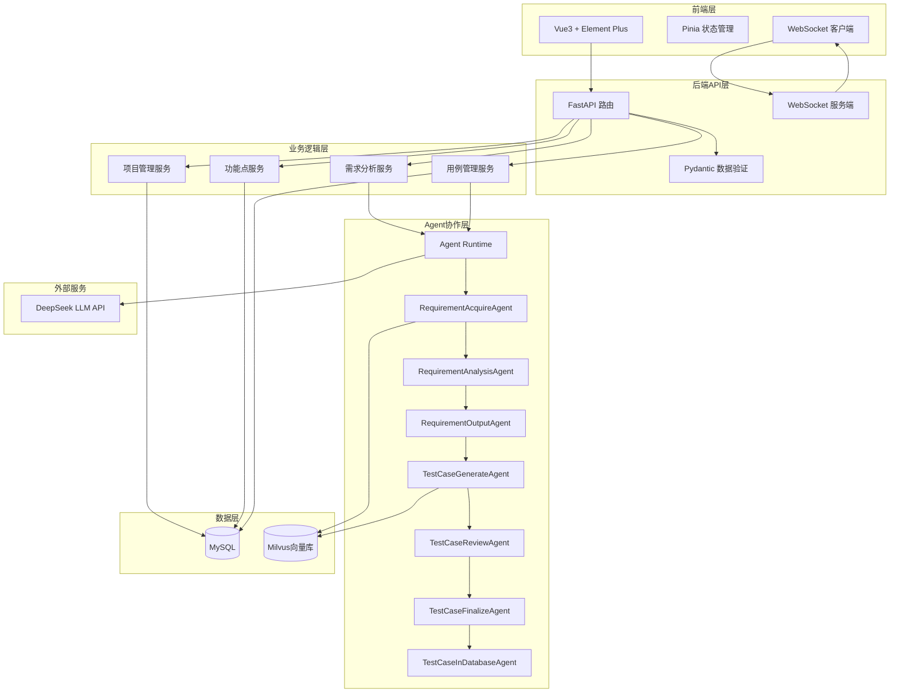

## 产品概述

「qaitest 智测平台」是一个企业级的AI测试用例生成系统，通过多智能体协作自动分析需求文档、提取功能点并生成高质量测试用例，大幅提升测试效率。

## 核心功能模块

### 1. 项目管理

- 创建、编辑、删除、查看测试项目
- 项目列表展示与搜索
- 项目详情页面

### 2. 需求分析（核心界面）

- 项目选择下拉框
- 需求文档上传（支持txt/pdf/md格式）
- 需求描述文本输入
- "开始分析"按钮触发Agent流水线
- 实时显示区域（类似Terminal/对话框）：通过WebSocket实时展示AutoGen智能体的推理、对话、执行过程
- 自动提取功能点并存储

### 3. 功能点管理

- 展示从需求中提取的功能点列表
- 支持编辑、删除功能点
- 按项目、类别、关键词筛选
- 功能点详情查看

### 4. 用例生成

- 选择功能点触发用例生成
- 实时显示Agent生成过程
- 生成完成后自动跳转到用例管理

### 5. 用例管理

- 测试用例列表展示（表格形式）
- 用例详情查看（步骤、预期结果等）
- 支持导出为Excel和Markdown格式
- 按项目、优先级、状态筛选

## 核心业务流程

需求文档上传 → 文档解析与RAG索引 → 需求分析Agent → 功能点提取 → 用例生成Agent → 用例评审Agent → 用例入库 → 导出

## 技术栈

### 后端技术栈

- **框架**: FastAPI (异步模式)
- **数据库**: MySQL 8.0+
- **ORM**: Tortoise ORM (全异步)
- **数据验证**: Pydantic v2
- **日志**: Loguru
- **向量数据库**: Milvus 2.x
- **多智能体框架**: AutoGen 0.7.5 (autogen-agentchat, autogen-core, autogen-ext)
- **LLM**: DeepSeek API
- **实时通信**: WebSocket (FastAPI原生支持)

### 前端技术栈

- **框架**: Vue 3 (Composition API, `<script setup>`语法)
- **构建工具**: Vite 5.x
- **语言**: TypeScript 5.x
- **UI组件库**: Element Plus
- **状态管理**: Pinia
- **路由**: Vue Router 4
- **HTTP客户端**: Axios
- **实时通信**: 原生WebSocket API
- **代码规范**: ESLint + Prettier

## 系统架构设计

### 整体架构



### AutoGen多智能体架构

#### 需求分析流水线

```python
# 消息类型定义
RequirementFilesMessage -> RequirementMessage -> TestCaseMessage

# Agent注册与订阅
@type_subscription(topic_type='requirement_acquire')
class RequirementAcquireAgent(RoutedAgent):
    """需求获取：文档加载 → RAG索引 → LLM分析"""
    
@type_subscription(topic_type='requirement_analysis')  
class RequirementAnalysisAgent(RoutedAgent):
    """需求分析：生成结构化需求分析报告"""
    
@type_subscription(topic_type='requirement_output')
class RequirementOutputAgent(RoutedAgent):
    """需求输出：转换为JSON格式功能点"""
```

#### 用例生成流水线

```python
@type_subscription(topic_type='case_generate')
class TestCaseGenerateAgent(RoutedAgent):
    """用例生成：基于需求+RAG知识库生成测试用例"""
    
@type_subscription(topic_type='case_review')
class TestCaseReviewAgent(RoutedAgent):
    """用例评审：质量评审，输出评审报告"""
    
@type_subscription(topic_type='testcase_finalize')
class TestCaseFinalizeAgent(RoutedAgent):
    """用例定稿：结合评审报告转为JSON格式"""
    
@type_subscription(topic_type='case_in_database')
class TestCaseInDatabaseAgent(RoutedAgent):
    """用例入库：写入MySQL数据库"""
```

#### 实时流式输出机制

```python
# 使用async generator实现流式输出
async def stream_agent_process(task):
    stream = agent.run_stream(task=task)
    async for msg in stream:
        if isinstance(msg, ModelClientStreamingChunkEvent):
            # 通过WebSocket发送到前端
            yield {"type": "chunk", "content": msg.content}
        elif isinstance(msg, TaskResult):
            yield {"type": "complete", "content": msg.messages[-1].content}
```

### 数据库设计

#### 项目表 (projects)

```sql
CREATE TABLE projects (
    id INT PRIMARY KEY AUTO_INCREMENT,
    name VARCHAR(255) NOT NULL COMMENT '项目名称',
    description TEXT COMMENT '项目描述',
    created_at TIMESTAMP DEFAULT CURRENT_TIMESTAMP,
    updated_at TIMESTAMP DEFAULT CURRENT_TIMESTAMP ON UPDATE CURRENT_TIMESTAMP,
    INDEX idx_name (name)
) ENGINE=InnoDB DEFAULT CHARSET=utf8mb4 COMMENT='测试项目表';
```

#### 需求表 (requirements)

```sql
CREATE TABLE requirements (
    id INT PRIMARY KEY AUTO_INCREMENT,
    project_id INT NOT NULL,
    name VARCHAR(500) NOT NULL COMMENT '需求名称',
    description TEXT COMMENT '需求描述',
    category VARCHAR(50) COMMENT '类别：功能/性能/安全/接口/体验',
    module VARCHAR(100) COMMENT '所属模块',
    level VARCHAR(20) COMMENT '需求层级',
    reviewer VARCHAR(50) COMMENT '评审人',
    estimated INT COMMENT '预估工时',
    criteria TEXT COMMENT '验收标准',
    remark TEXT COMMENT '备注',
    keywords VARCHAR(500) COMMENT '关键词',
    created_at TIMESTAMP DEFAULT CURRENT_TIMESTAMP,
    updated_at TIMESTAMP DEFAULT CURRENT_TIMESTAMP ON UPDATE CURRENT_TIMESTAMP,
    INDEX idx_project (project_id),
    INDEX idx_category (category),
    FOREIGN KEY (project_id) REFERENCES projects(id) ON DELETE CASCADE
) ENGINE=InnoDB DEFAULT CHARSET=utf8mb4 COMMENT='需求功能点表';
```

#### 测试用例表 (test_cases)

```sql
CREATE TABLE test_cases (
    id INT PRIMARY KEY AUTO_INCREMENT,
    project_id INT NOT NULL,
    requirement_id INT COMMENT '关联需求ID',
    title VARCHAR(500) NOT NULL COMMENT '用例标题',
    description TEXT COMMENT '用例描述',
    priority VARCHAR(20) COMMENT '优先级：高/中/低',
    status VARCHAR(20) DEFAULT '未开始' COMMENT '状态：未开始/进行中/通过/失败/阻塞',
    test_type VARCHAR(50) COMMENT '测试类型：功能/接口/性能/安全',
    preconditions TEXT COMMENT '前置条件',
    postconditions TEXT COMMENT '后置条件',
    creator VARCHAR(50) DEFAULT 'AI' COMMENT '创建者',
    created_at TIMESTAMP DEFAULT CURRENT_TIMESTAMP,
    updated_at TIMESTAMP DEFAULT CURRENT_TIMESTAMP ON UPDATE CURRENT_TIMESTAMP,
    INDEX idx_project (project_id),
    INDEX idx_requirement (requirement_id),
    INDEX idx_priority (priority),
    FOREIGN KEY (project_id) REFERENCES projects(id) ON DELETE CASCADE,
    FOREIGN KEY (requirement_id) REFERENCES requirements(id) ON DELETE SET NULL
) ENGINE=InnoDB DEFAULT CHARSET=utf8mb4 COMMENT='测试用例表';
```

#### 测试步骤表 (test_steps)

```sql
CREATE TABLE test_steps (
    id INT PRIMARY KEY AUTO_INCREMENT,
    test_case_id INT NOT NULL,
    step_number INT NOT NULL COMMENT '步骤序号',
    description TEXT NOT NULL COMMENT '步骤描述',
    expected_result TEXT COMMENT '预期结果',
    created_at TIMESTAMP DEFAULT CURRENT_TIMESTAMP,
    INDEX idx_testcase (test_case_id),
    FOREIGN KEY (test_case_id) REFERENCES test_cases(id) ON DELETE CASCADE
) ENGINE=InnoDB DEFAULT CHARSET=utf8mb4 COMMENT='测试步骤表';
```

### API接口设计

#### 项目管理

- `POST /api/projects` - 创建项目
- `GET /api/projects` - 获取项目列表
- `GET /api/projects/{id}` - 获取项目详情
- `PUT /api/projects/{id}` - 更新项目
- `DELETE /api/projects/{id}` - 删除项目

#### 需求分析

- `POST /api/requirements/analyze` - 上传需求文档并开始分析
- `WebSocket /ws/analysis/{session_id}` - 实时获取分析过程
- `GET /api/requirements/project/{project_id}` - 获取项目的功能点列表

#### 功能点管理

- `GET /api/requirements/{id}` - 获取功能点详情
- `PUT /api/requirements/{id}` - 更新功能点
- `DELETE /api/requirements/{id}` - 删除功能点

#### 用例生成

- `POST /api/testcases/generate` - 触发用例生成
- `WebSocket /ws/generate/{session_id}` - 实时获取生成过程

#### 用例管理

- `GET /api/testcases` - 获取用例列表
- `GET /api/testcases/{id}` - 获取用例详情
- `PUT /api/testcases/{id}` - 更新用例
- `DELETE /api/testcases/{id}` - 删除用例
- `GET /api/testcases/export/excel` - 导出Excel
- `GET /api/testcases/export/markdown` - 导出Markdown

## 目录结构

```
qaitest/
├── backend/                     # 后端目录
│   ├── app/
│   │   ├── __init__.py
│   │   ├── main.py             # FastAPI应用入口
│   │   ├── config.py           # 配置文件
│   │   ├── database.py         # 数据库连接
│   │   ├── models/             # Tortoise ORM模型
│   │   │   ├── __init__.py
│   │   │   ├── project.py
│   │   │   ├── requirement.py
│   │   │   └── testcase.py
│   │   ├── schemas/            # Pydantic模型
│   │   │   ├── __init__.py
│   │   │   ├── project.py
│   │   │   ├── requirement.py
│   │   │   └── testcase.py
│   │   ├── api/                # API路由
│   │   │   ├── __init__.py
│   │   │   ├── projects.py
│   │   │   ├── requirements.py
│   │   │   ├── testcases.py
│   │   │   └── websocket.py
│   │   ├── agents/             # AutoGen智能体
│   │   │   ├── __init__.py
│   │   │   ├── runtime.py      # Agent运行时
│   │   │   ├── messages.py     # 消息类型定义
│   │   │   ├── requirement_agents.py    # 需求分析流水线
│   │   │   └── testcase_agents.py       # 用例生成流水线
│   │   ├── services/           # 业务服务层
│   │   │   ├── __init__.py
│   │   │   ├── project_service.py
│   │   │   ├── requirement_service.py
│   │   │   └── testcase_service.py
│   │   ├── rag/                # RAG相关
│   │   │   ├── __init__.py
│   │   │   ├── document_loader.py
│   │   │   └── milvus_client.py
│   │   └── utils/              # 工具函数
│   │       ├── __init__.py
│   │       └── logger.py
│   ├── tests/                  # 测试文件
│   ├── alembic/                # 数据库迁移
│   ├── requirements.txt        # Python依赖
│   └── .env.example            # 环境变量示例
│
├── frontend/                   # 前端目录
│   ├── public/
│   ├── src/
│   │   ├── main.ts            # 应用入口
│   │   ├── App.vue            # 根组件
│   │   ├── router/            # 路由配置
│   │   │   └── index.ts
│   │   ├── stores/            # Pinia状态管理
│   │   │   ├── project.ts
│   │   │   ├── requirement.ts
│   │   │   └── testcase.ts
│   │   ├── views/             # 页面组件
│   │   │   ├── ProjectList.vue
│   │   │   ├── ProjectDetail.vue
│   │   │   ├── RequirementAnalysis.vue
│   │   │   ├── RequirementList.vue
│   │   │   ├── TestCaseGenerate.vue
│   │   │   └── TestCaseList.vue
│   │   ├── components/        # 通用组件
│   │   │   ├── Layout.vue
│   │   │   ├── Terminal.vue   # 实时输出终端组件
│   │   │   └── FileUpload.vue
│   │   ├── api/               # API请求
│   │   │   ├── request.ts     # Axios封装
│   │   │   ├── project.ts
│   │   │   ├── requirement.ts
│   │   │   └── testcase.ts
│   │   ├── types/             # TypeScript类型定义
│   │   │   └── index.ts
│   │   ├── utils/             # 工具函数
│   │   │   └── websocket.ts
│   │   └── styles/            # 样式文件
│   │       └── global.css
│   ├── index.html
│   ├── vite.config.ts
│   ├── tsconfig.json
│   ├── package.json
│   └── .env.example
│
├── docker-compose.yml          # Docker编排文件
├── README.md                   # 项目文档
└── .gitignore
```

## 实施要点

### AutoGen 0.7.5 关键实践

1. **严格使用异步API**: 所有Agent方法必须使用`async/await`
2. **RoutedAgent + message_handler**: 使用`@message_handler`装饰器处理消息
3. **Topic订阅发布**: 通过`@type_subscription`订阅Topic，使用`publish_message`发布消息
4. **流式输出**: 使用`run_stream()`获取异步生成器，实时输出到WebSocket
5. **DeepSeek配置**: 使用`OpenAIChatCompletionClient`适配DeepSeek API

### 前端实时输出实现

1. **WebSocket连接**: 建立WebSocket连接监听Agent输出
2. **Terminal组件**: 使用Element Plus的滚动容器，实时追加输出内容
3. **自动滚动**: 新内容到达时自动滚动到底部
4. **格式化显示**: 支持Markdown渲染和代码高亮

### 性能优化

1. **数据库索引**: 为常用查询字段添加索引
2. **Milvus批量操作**: 批量插入向量，减少网络开销
3. **WebSocket连接池**: 复用WebSocket连接
4. **前端虚拟滚动**: 大列表使用虚拟滚动
5. **API分页**: 所有列表接口支持分页

### 错误处理

1. **全局异常捕获**: FastAPI全局异常处理器
2. **Agent重试机制**: LLM调用失败自动重试
3. **WebSocket重连**: 断线自动重连
4. **日志记录**: Loguru记录详细日志

### 安全考虑

1. **文件上传限制**: 限制文件大小和类型
2. **SQL注入防护**: 使用ORM参数化查询
3. **XSS防护**: 前端输入过滤和输出转义
4. **API限流**: 使用slowapi限制请求频率

## 设计风格

采用现代简约的企业级设计风格，以专业、高效、易用为核心理念。使用蓝色系为主色调，体现科技感和专业性。界面布局清晰，信息层级分明，支持深色/浅色模式切换。

## 页面规划

### 1. 项目列表页

**顶部导航栏**：Logo、系统名称、全局搜索、主题切换按钮
**左侧菜单栏**：项目管理、需求分析、功能点管理、用例生成、用例管理
**主内容区**：

- 页面标题+新建项目按钮
- 项目卡片列表（卡片展示：项目名称、描述、创建时间、用例数量）
- 搜索框和筛选器

### 2. 需求分析页（核心界面）

**顶部区域**：项目选择下拉框
**左侧区域**：

- 文件上传区域（拖拽上传，支持txt/pdf/md）
- 需求描述文本框（多行输入）
- "开始分析"按钮（醒目的主要操作按钮）

**右侧区域**：

- Terminal风格实时输出区域
- 黑色背景，绿色/白色文字
- 自动滚动，显示Agent推理过程
- 支持暂停/继续/清空操作

**底部区域**：分析完成后显示功能点预览

### 3. 功能点列表页

**顶部区域**：搜索框、筛选器（项目、类别、关键词）
**主内容区**：

- 表格展示：序号、名称、类别、模块、优先级、操作
- 支持编辑、删除、查看详情
- 分页组件

### 4. 用例生成页

**左侧区域**：功能点选择列表（多选）
**右侧区域**：

- Terminal风格实时输出区域
- 显示用例生成过程
- 生成完成后显示用例预览

### 5. 用例列表页

**顶部区域**：搜索框、筛选器、导出按钮（Excel/Markdown）
**主内容区**：

- 表格展示：序号、标题、优先级、状态、测试类型、操作
- 支持查看详情、编辑、删除
- 分页组件

**用例详情弹窗**：

- 基本信息区：标题、描述、优先级、状态
- 前置条件、后置条件
- 测试步骤列表（步骤序号、描述、预期结果）