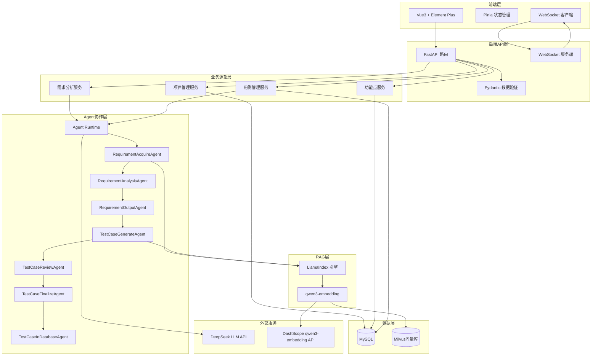

## 产品概述

「qaitest 智测平台」是一个企业级的AI测试用例生成系统，通过多智能体协作自动分析需求文档、提取功能点并生成高质量测试用例，大幅提升测试效率。

## 核心功能模块

### 1. 项目管理

- 创建、编辑、删除、查看测试项目
- 项目列表展示与搜索
- 项目详情页面

### 2. 需求分析（核心界面）

- 项目选择下拉框
- 需求文档上传（支持txt/pdf/md格式）
- 需求描述文本输入
- "开始分析"按钮触发Agent流水线
- 实时显示区域（类似Terminal/对话框）：通过WebSocket实时展示AutoGen智能体的推理、对话、执行过程
- 自动提取功能点并存储

### 3. 功能点管理

- 展示从需求中提取的功能点列表
- 支持编辑、删除功能点
- 按项目、类别、关键词筛选

### 4. 用例生成

- 选择功能点触发用例生成
- 基于RAG检索相关测试知识和最佳实践
- 自动生成测试用例
- **智能评审环节**：自动评审用例质量（覆盖率、可执行性、逻辑正确性）
- 根据评审报告优化用例
- 实时显示Agent生成和评审过程

### 5. 用例管理

- 测试用例列表展示（表格形式）
- 用例详情查看（步骤、预期结果等）
- 支持导出为Excel和Markdown格式

## 技术栈

### 后端技术栈

- **框架**: FastAPI (异步模式)
- **数据库**: MySQL 8.0+
- **ORM**: Tortoise ORM (全异步)
- **数据验证**: Pydantic v2
- **日志**: Loguru
- **向量数据库**: Milvus 2.x
- **RAG框架**: LlamaIndex (llama-index-core, llama-index-vector-stores-milvus)
- **嵌入模型**: qwen3-embedding (通过DashScope API)
- **多智能体框架**: AutoGen 0.7.5 (autogen-agentchat, autogen-core, autogen-ext)
- **LLM**: DeepSeek API
- **实时通信**: WebSocket (FastAPI原生支持)

### 前端技术栈

- **框架**: Vue 3 (Composition API, `<script setup>`语法)
- **构建工具**: Vite 5.x
- **语言**: TypeScript 5.x
- **UI组件库**: Element Plus
- **状态管理**: Pinia
- **路由**: Vue Router 4
- **HTTP客户端**: Axios
- **实时通信**: 原生WebSocket API

## 系统架构设计

### 整体架构



### LlamaIndex + qwen3-embedding 集成架构

```python
# 嵌入模型配置 (使用DashScope qwen3-embedding)
from llama_index.embeddings.dashscope import DashScopeEmbedding

embed_model = DashScopeEmbedding(
    model_name="text-embedding-v3",
    api_key=os.getenv("DASHSCOPE_API_KEY"),
    embed_batch_size=10
)

# Milvus向量存储配置
from llama_index.vector_stores.milvus import MilvusVectorStore
from llama_index.core import VectorStoreIndex, StorageContext

vector_store = MilvusVectorStore(
    uri=os.getenv("MILVUS_URI"),
    token=os.getenv("MILVUS_TOKEN"),
    collection_name=f"project_{project_id}",
    dim=1024  # qwen3-embedding维度
)

storage_context = StorageContext.from_defaults(vector_store=vector_store)
index = VectorStoreIndex.from_documents(
    documents, 
    storage_context=storage_context,
    embed_model=embed_model
)
```

### AutoGen多智能体架构

#### 需求分析流水线

- **RequirementAcquireAgent**: 文档加载 -> LlamaIndex RAG索引 -> LLM分析
- **RequirementAnalysisAgent**: 生成结构化需求分析报告
- **RequirementOutputAgent**: 转换为JSON格式功能点

#### 用例生成流水线（**含RAG和评审**）

1. **TestCaseGenerateAgent**: 

- 输入：功能点需求描述
- **RAG检索**：从Milvus检索相关测试知识、测试模式、最佳实践
- 生成测试用例（包含前置条件、测试步骤、预期结果）

2. **TestCaseReviewAgent**（**关键评审环节**）:

- 需求覆盖度审查：确保每个需求点都有对应测试用例
- 测试深度审查：正常流/边界值/异常流全面覆盖
- 可执行性审查：步骤清晰、数据明确
- 逻辑正确性审查：检查测试步骤/预期结果是否符合业务逻辑
- 输出评审报告（包含问题分类、改进建议）

3. **TestCaseFinalizeAgent**:

- 结合评审报告优化用例
- 转换为标准JSON格式

4. **TestCaseInDatabaseAgent**: 

- 写入MySQL数据库
- 同时保存用例和测试步骤

#### RAG应用场景（**两处核心应用**）

**场景1：需求分析阶段**

- 目的：文档解析和向量化存储
- 流程：上传文档 → 解析 → 分块 → qwen3-embedding嵌入 → 存入Milvus
- 后续用途：为用例生成阶段提供知识检索基础

**场景2：用例生成阶段**

- 目的：检索相关测试知识和最佳实践
- 流程：根据需求描述 → 相似度检索 → 获取相关测试模式 → 辅助生成高质量用例
- 检索内容：测试设计模式、边界值分析方法、异常场景示例等

## 目录结构

```
qaitest/
├── backend/                     # 后端目录
│   ├── app/
│   │   ├── __init__.py
│   │   ├── main.py             # FastAPI应用入口
│   │   ├── config.py           # 配置文件
│   │   ├── database.py         # 数据库连接
│   │   ├── models/             # Tortoise ORM模型
│   │   │   ├── __init__.py
│   │   │   ├── project.py
│   │   │   ├── requirement.py
│   │   │   └── testcase.py
│   │   ├── schemas/            # Pydantic模型
│   │   │   ├── __init__.py
│   │   │   ├── project.py
│   │   │   ├── requirement.py
│   │   │   └── testcase.py
│   │   ├── api/                # API路由
│   │   │   ├── __init__.py
│   │   │   ├── projects.py
│   │   │   ├── requirements.py
│   │   │   ├── testcases.py
│   │   │   └── websocket.py
│   │   ├── agents/             # AutoGen智能体
│   │   │   ├── __init__.py
│   │   │   ├── runtime.py      # Agent运行时
│   │   │   ├── messages.py     # 消息类型定义
│   │   │   ├── requirement_agents.py
│   │   │   └── testcase_agents.py
│   │   ├── services/           # 业务服务层
│   │   │   ├── __init__.py
│   │   │   ├── project_service.py
│   │   │   ├── requirement_service.py
│   │   │   └── testcase_service.py
│   │   ├── rag/                # LlamaIndex RAG模块
│   │   │   ├── __init__.py
│   │   │   ├── embeddings.py   # qwen3-embedding配置
│   │   │   ├── document_loader.py  # 文档加载器
│   │   │   ├── vector_store.py     # Milvus向量存储
│   │   │   └── index_manager.py    # 索引管理器
│   │   └── utils/              # 工具函数
│   │       ├── __init__.py
│   │       └── logger.py
│   ├── requirements.txt
│   └── .env.example
│
├── frontend/                   # 前端目录
│   ├── src/
│   │   ├── main.ts
│   │   ├── App.vue
│   │   ├── router/index.ts
│   │   ├── stores/
│   │   ├── views/
│   │   ├── components/
│   │   ├── api/
│   │   ├── types/
│   │   └── styles/
│   ├── vite.config.ts
│   └── package.json
│
└── README.md
```

## 实施要点

### LlamaIndex + qwen3-embedding 关键实践

1. **嵌入模型配置**: 使用DashScopeEmbedding适配qwen3-embedding API
2. **向量维度**: qwen3-embedding输出1024维向量
3. **批量嵌入**: 设置合理的embed_batch_size优化性能
4. **Milvus集成**: 使用llama-index-vector-stores-milvus

### AutoGen 0.7.5 关键实践

1. **严格使用异步API**: 所有Agent方法必须使用async/await
2. **RoutedAgent + message_handler**: 使用@message_handler装饰器处理消息
3. **Topic订阅发布**: 通过@type_subscription订阅Topic
4. **流式输出**: 使用run_stream()获取异步生成器

### 前端实时输出实现

1. **WebSocket连接**: 建立WebSocket连接监听Agent输出
2. **Terminal组件**: 使用Element Plus的滚动容器，实时追加输出内容
3. **自动滚动**: 新内容到达时自动滚动到底部

## 核心依赖包

```
# 后端 requirements.txt
fastapi>=0.109.0
uvicorn[standard]>=0.27.0
tortoise-orm[asyncmy]>=0.20.0
pydantic>=2.5.0
loguru>=0.7.2
python-multipart>=0.0.6
autogen-agentchat>=0.7.5
autogen-core>=0.7.5
autogen-ext>=0.7.5
llama-index-core>=0.11.0
llama-index-vector-stores-milvus>=0.4.0
llama-index-embeddings-dashscope>=0.3.0
pymilvus>=2.4.0
openai>=1.12.0
```

## 设计风格

采用现代简约的企业级设计风格，以专业、高效、易用为核心理念。使用蓝色系为主色调，体现科技感和专业性。界面布局清晰，信息层级分明。

## 页面规划

### 1. 项目列表页

- 顶部导航栏：Logo、系统名称、全局搜索、主题切换按钮
- 左侧菜单栏：项目管理、需求分析、功能点管理、用例生成、用例管理
- 主内容区：页面标题+新建项目按钮、项目卡片列表、搜索框和筛选器

### 2. 需求分析页（核心界面）

- 顶部区域：项目选择下拉框
- 左侧区域：文件上传区域（拖拽上传，支持txt/pdf/md）、需求描述文本框、"开始分析"按钮
- 右侧区域：Terminal风格实时输出区域，黑色背景，绿色/白色文字，自动滚动
- 底部区域：分析完成后显示功能点预览

### 3. 功能点列表页

- 顶部区域：搜索框、筛选器
- 主内容区：表格展示、分页组件

### 4. 用例生成页

- 左侧区域：功能点选择列表（多选）
- 右侧区域：Terminal风格实时输出区域

### 5. 用例列表页

- 顶部区域：搜索框、筛选器、导出按钮（Excel/Markdown）
- 主内容区：表格展示、用例详情弹窗

## Agent Extensions

### SubAgent

- **code-explorer**
- Purpose: 在实现过程中探索代码库结构，确保架构一致性
- Expected outcome: 快速定位相关代码文件和依赖关系

### Skill

- **pdf**
- Purpose: 处理PDF格式的需求文档上传和解析
- Expected outcome: 从PDF文件中提取文本内容用于需求分析
- **docx**
- Purpose: 处理Word格式的需求文档上传和解析
- Expected outcome: 从DOCX文件中提取文本内容用于需求分析
- **xlsx**
- Purpose: 导出测试用例为Excel格式
- Expected outcome: 生成格式规范的测试用例Excel文件