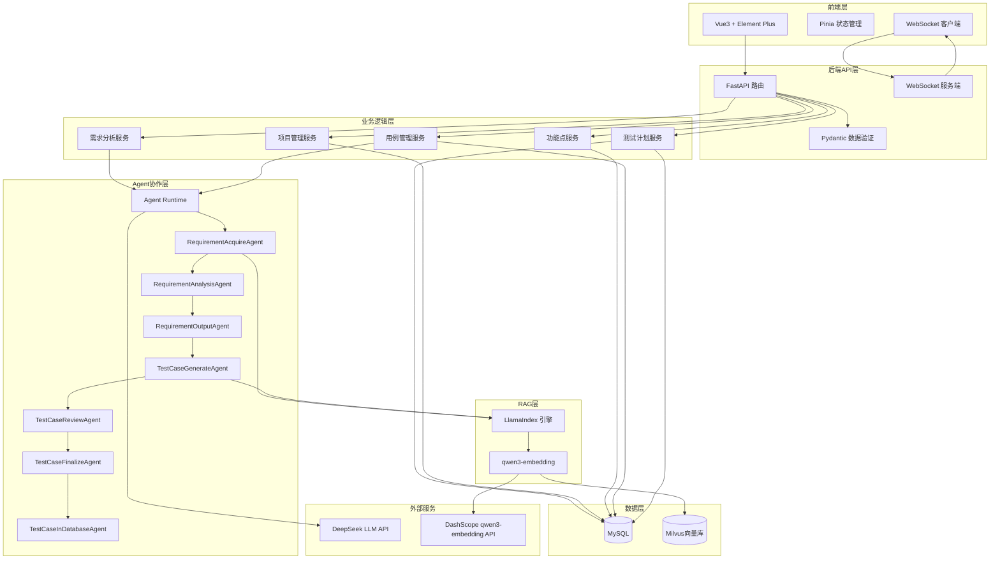

## 产品概述

「qaitest 智测平台」是一个企业级的AI测试用例生成系统，通过多智能体协作自动分析需求文档、提取功能点并生成高质量测试用例，并提供测试计划管理和执行跟踪功能，大幅提升测试效率。

## 核心功能模块

### 1. 项目管理

- 创建、编辑、删除、查看测试项目
- 项目列表展示与搜索
- 项目详情页面

### 2. 需求分析（核心界面）

- 项目选择下拉框
- 需求文档上传（支持txt/pdf/md格式）
- 需求描述文本输入
- "开始分析"按钮触发Agent流水线
- 实时显示区域（类似Terminal/对话框）：通过WebSocket实时展示AutoGen智能体的推理、对话、执行过程
- 自动提取功能点并存储

### 3. 功能点管理

- 展示从需求中提取的功能点列表
- 支持编辑、删除功能点
- 按项目、类别、关键词筛选

### 4. 用例生成

- 选择功能点触发用例生成
- 基于RAG检索相关测试知识和最佳实践
- 自动生成测试用例
- 智能评审环节：自动评审用例质量（覆盖率、可执行性、逻辑正确性）
- 根据评审报告优化用例
- 实时显示Agent生成和评审过程

### 5. 用例管理

- 测试用例列表展示（表格形式）
- 用例详情查看（步骤、预期结果等）
- 支持导出为Excel和Markdown格式

### 6. 测试计划管理（新增）

- 创建、编辑、删除、查看测试计划
- 测试计划列表展示与搜索
- 批量添加测试用例到计划
- 测试计划状态管理（未开始/进行中/已完成/已归档）
- 测试计划执行进度跟踪
- 测试用例执行状态更新（通过/失败/阻塞/未执行）
- 执行情况统计和可视化展示
- 测试计划关联到项目

## 技术栈

### 后端技术栈

- **框架**: FastAPI (异步模式)
- **数据库**: MySQL 8.0+
- **ORM**: Tortoise ORM (全异步)
- **数据验证**: Pydantic v2
- **日志**: Loguru
- **向量数据库**: Milvus 2.x
- **RAG框架**: LlamaIndex (llama-index-core, llama-index-vector-stores-milvus)
- **嵌入模型**: qwen3-embedding (通过DashScope API)
- **多智能体框架**: AutoGen 0.7.5 (autogen-agentchat, autogen-core, autogen-ext)
- **LLM**: DeepSeek API
- **实时通信**: WebSocket (FastAPI原生支持)

### 前端技术栈

- **框架**: Vue 3 (Composition API, `<script setup>`语法)
- **构建工具**: Vite 5.x
- **语言**: TypeScript 5.x
- **UI组件库**: Element Plus
- **状态管理**: Pinia
- **路由**: Vue Router 4
- **HTTP客户端**: Axios
- **实时通信**: 原生WebSocket API

## 系统架构设计

### 整体架构



### 数据库设计

#### 核心表结构

```sql
-- 项目表
CREATE TABLE projects (
    id INT PRIMARY KEY AUTO_INCREMENT,
    name VARCHAR(200) NOT NULL,
    description TEXT,
    status VARCHAR(20) DEFAULT '活跃',
    created_at TIMESTAMP DEFAULT CURRENT_TIMESTAMP,
    updated_at TIMESTAMP DEFAULT CURRENT_TIMESTAMP ON UPDATE CURRENT_TIMESTAMP
);

-- 功能点表
CREATE TABLE requirements (
    id INT PRIMARY KEY AUTO_INCREMENT,
    project_id INT NOT NULL,
    name VARCHAR(500) NOT NULL,
    description TEXT,
    category VARCHAR(50),
    module VARCHAR(100),
    priority VARCHAR(10),
    acceptance_criteria TEXT,
    keywords VARCHAR(500),
    created_at TIMESTAMP DEFAULT CURRENT_TIMESTAMP,
    INDEX idx_project (project_id),
    FOREIGN KEY (project_id) REFERENCES projects(id) ON DELETE CASCADE
);

-- 测试用例表
CREATE TABLE test_cases (
    id INT PRIMARY KEY AUTO_INCREMENT,
    project_id INT NOT NULL,
    requirement_id INT,
    title VARCHAR(500) NOT NULL,
    description TEXT,
    priority VARCHAR(20),
    status VARCHAR(20) DEFAULT '未开始',
    test_type VARCHAR(50),
    preconditions TEXT,
    postconditions TEXT,
    creator VARCHAR(50) DEFAULT 'AI',
    created_at TIMESTAMP DEFAULT CURRENT_TIMESTAMP,
    updated_at TIMESTAMP DEFAULT CURRENT_TIMESTAMP ON UPDATE CURRENT_TIMESTAMP,
    INDEX idx_project (project_id),
    INDEX idx_requirement (requirement_id),
    FOREIGN KEY (project_id) REFERENCES projects(id) ON DELETE CASCADE,
    FOREIGN KEY (requirement_id) REFERENCES requirements(id) ON DELETE SET NULL
);

-- 测试步骤表
CREATE TABLE test_steps (
    id INT PRIMARY KEY AUTO_INCREMENT,
    test_case_id INT NOT NULL,
    step_number INT NOT NULL,
    description TEXT NOT NULL,
    expected_result TEXT,
    created_at TIMESTAMP DEFAULT CURRENT_TIMESTAMP,
    INDEX idx_testcase (test_case_id),
    FOREIGN KEY (test_case_id) REFERENCES test_cases(id) ON DELETE CASCADE
);

-- 测试计划表（新增）
CREATE TABLE test_plans (
    id INT PRIMARY KEY AUTO_INCREMENT,
    project_id INT NOT NULL,
    name VARCHAR(200) NOT NULL,
    description TEXT,
    status VARCHAR(20) DEFAULT '未开始',
    start_time DATETIME,
    end_time DATETIME,
    created_at TIMESTAMP DEFAULT CURRENT_TIMESTAMP,
    updated_at TIMESTAMP DEFAULT CURRENT_TIMESTAMP ON UPDATE CURRENT_TIMESTAMP,
    INDEX idx_project (project_id),
    FOREIGN KEY (project_id) REFERENCES projects(id) ON DELETE CASCADE
);

-- 测试计划用例关联表（新增）
CREATE TABLE test_plan_cases (
    id INT PRIMARY KEY AUTO_INCREMENT,
    test_plan_id INT NOT NULL,
    test_case_id INT NOT NULL,
    execution_status VARCHAR(20) DEFAULT '未执行',
    executed_at DATETIME,
    executor VARCHAR(50),
    notes TEXT,
    created_at TIMESTAMP DEFAULT CURRENT_TIMESTAMP,
    INDEX idx_plan (test_plan_id),
    INDEX idx_case (test_case_id),
    FOREIGN KEY (test_plan_id) REFERENCES test_plans(id) ON DELETE CASCADE,
    FOREIGN KEY (test_case_id) REFERENCES test_cases(id) ON DELETE CASCADE
);
```

### API接口设计

#### 测试计划相关接口

```
GET    /api/testplans                    # 获取测试计划列表（支持分页、搜索）
POST   /api/testplans                    # 创建测试计划
GET    /api/testplans/{id}               # 获取测试计划详情（含关联的用例）
PUT    /api/testplans/{id}               # 更新测试计划
DELETE /api/testplans/{id}               # 删除测试计划
POST   /api/testplans/{id}/cases         # 批量添加测试用例到计划
DELETE /api/testplans/{id}/cases/{case_id}  # 从计划中移除测试用例
PUT    /api/testplans/{id}/cases/{case_id}/status  # 更新用例执行状态
GET    /api/testplans/{id}/statistics    # 获取测试计划执行统计
PUT    /api/testplans/{id}/status        # 更新测试计划状态
```

### 目录结构

```
qaitest/
├── backend/
│   ├── app/
│   │   ├── __init__.py
│   │   ├── main.py
│   │   ├── config.py
│   │   ├── database.py
│   │   ├── models/
│   │   │   ├── __init__.py
│   │   │   ├── project.py
│   │   │   ├── requirement.py
│   │   │   ├── testcase.py
│   │   │   └── testplan.py           # [NEW] 测试计划模型
│   │   ├── schemas/
│   │   │   ├── __init__.py
│   │   │   ├── project.py
│   │   │   ├── requirement.py
│   │   │   ├── testcase.py
│   │   │   └── testplan.py           # [NEW] 测试计划Schema
│   │   ├── api/
│   │   │   ├── __init__.py
│   │   │   ├── projects.py
│   │   │   ├── requirements.py
│   │   │   ├── testcases.py
│   │   │   ├── testplans.py          # [NEW] 测试计划API
│   │   │   └── websocket.py
│   │   ├── agents/
│   │   │   ├── __init__.py
│   │   │   ├── runtime.py
│   │   │   ├── messages.py
│   │   │   ├── requirement_agents.py
│   │   │   └── testcase_agents.py
│   │   ├── services/
│   │   │   ├── __init__.py
│   │   │   ├── project_service.py
│   │   │   ├── requirement_service.py
│   │   │   ├── testcase_service.py
│   │   │   └── testplan_service.py   # [NEW] 测试计划服务
│   │   ├── rag/
│   │   │   ├── __init__.py
│   │   │   ├── embeddings.py
│   │   │   ├── document_loader.py
│   │   │   ├── vector_store.py
│   │   │   └── index_manager.py
│   │   └── utils/
│   │       ├── __init__.py
│   │       └── logger.py
│   ├── requirements.txt
│   └── .env.example
│
├── frontend/
│   ├── src/
│   │   ├── main.ts
│   │   ├── App.vue
│   │   ├── router/
│   │   │   └── index.ts
│   │   ├── stores/
│   │   │   ├── project.ts
│   │   │   ├── requirement.ts
│   │   │   ├── testcase.ts
│   │   │   └── testplan.ts           # [NEW] 测试计划状态管理
│   │   ├── views/
│   │   │   ├── ProjectList.vue
│   │   │   ├── RequirementAnalysis.vue
│   │   │   ├── RequirementList.vue
│   │   │   ├── TestCaseGenerate.vue
│   │   │   ├── TestCaseList.vue
│   │   │   ├── TestPlanList.vue      # [NEW] 测试计划列表页
│   │   │   └── TestPlanDetail.vue    # [NEW] 测试计划详情页
│   │   ├── components/
│   │   │   ├── Layout.vue
│   │   │   ├── Terminal.vue
│   │   │   └── TestPlanStatistics.vue  # [NEW] 执行统计组件
│   │   ├── api/
│   │   │   ├── project.ts
│   │   │   ├── requirement.ts
│   │   │   ├── testcase.ts
│   │   │   └── testplan.ts           # [NEW] 测试计划API
│   │   ├── types/
│   │   │   ├── project.ts
│   │   │   ├── requirement.ts
│   │   │   ├── testcase.ts
│   │   │   └── testplan.ts           # [NEW] 测试计划类型定义
│   │   └── styles/
│   │       └── index.css
│   ├── vite.config.ts
│   └── package.json
│
└── README.md
```

## 核心依赖包

```
# 后端 requirements.txt
fastapi>=0.109.0
uvicorn[standard]>=0.27.0
tortoise-orm[asyncmy]>=0.20.0
pydantic>=2.5.0
loguru>=0.7.2
python-multipart>=0.0.6
autogen-agentchat>=0.7.5
autogen-core>=0.7.5
autogen-ext>=0.7.5
llama-index-core>=0.11.0
llama-index-vector-stores-milvus>=0.4.0
llama-index-embeddings-dashscope>=0.3.0
pymilvus>=2.4.0
openai>=1.12.0
```

## 实施要点

### 测试计划功能关键实践

1. **多对多关系管理**: 使用中间表 test_plan_cases 管理计划与用例的关联
2. **执行状态跟踪**: 记录每个用例在计划中的执行状态和时间
3. **统计可视化**: 实时计算通过率、失败率等指标
4. **批量操作**: 支持批量添加用例到计划，批量更新执行状态

### LlamaIndex + qwen3-embedding 关键实践

1. **嵌入模型配置**: 使用DashScopeEmbedding适配qwen3-embedding API
2. **向量维度**: qwen3-embedding输出1024维向量
3. **批量嵌入**: 设置合理的embed_batch_size优化性能
4. **Milvus集成**: 使用llama-index-vector-stores-milvus

### AutoGen 0.7.5 关键实践

1. **严格使用异步API**: 所有Agent方法必须使用async/await
2. **RoutedAgent + message_handler**: 使用@message_handler装饰器处理消息
3. **Topic订阅发布**: 通过@type_subscription订阅Topic
4. **流式输出**: 使用run_stream()获取异步生成器

### 前端实时输出实现

1. **WebSocket连接**: 建立WebSocket连接监听Agent输出
2. **Terminal组件**: 使用Element Plus的滚动容器，实时追加输出内容
3. **自动滚动**: 新内容到达时自动滚动到底部

## 设计风格

采用现代简约的企业级设计风格，以专业、高效、易用为核心理念。使用蓝色系为主色调，体现科技感和专业性。界面布局清晰，信息层级分明。

## 页面规划

### 1. 项目列表页

- 顶部导航栏：Logo、系统名称、全局搜索、主题切换按钮
- 左侧菜单栏：项目管理、需求分析、功能点管理、用例生成、用例管理、测试计划管理
- 主内容区：页面标题+新建项目按钮、项目卡片列表、搜索框和筛选器

### 2. 需求分析页（核心界面）

- 顶部区域：项目选择下拉框
- 左侧区域：文件上传区域（拖拽上传，支持txt/pdf/md）、需求描述文本框、"开始分析"按钮
- 右侧区域：Terminal风格实时输出区域，黑色背景，绿色/白色文字，自动滚动
- 底部区域：分析完成后显示功能点预览

### 3. 功能点列表页

- 顶部区域：搜索框、筛选器
- 主内容区：表格展示、分页组件

### 4. 用例生成页

- 左侧区域：功能点选择列表（多选）
- 右侧区域：Terminal风格实时输出区域

### 5. 用例列表页

- 顶部区域：搜索框、筛选器、导出按钮（Excel/Markdown）
- 主内容区：表格展示、用例详情弹窗

### 6. 测试计划列表页（新增）

- 顶部区域：新建计划按钮、状态筛选器、搜索框
- 主内容区：测试计划卡片列表
- 计划名称、状态标签、用例数量、进度条
- 执行统计：通过/失败/阻塞/未执行数量
- 操作按钮：查看详情、编辑、删除
- 分页组件

### 7. 测试计划详情页（新增）

- 顶部区域：计划基本信息（名称、状态、时间、进度）
- 左侧区域：
- 统计卡片：用例总数、通过率、失败率
- 执行状态分布图（饼图）
- 右侧区域：
- 关联用例列表（表格）
- 批量添加用例按钮
- 用例执行状态更新操作
- 单个用例执行状态切换按钮
- 底部区域：
- 计划状态更新按钮（开始执行/完成/归档）

## Agent Extensions

### SubAgent

- **code-explorer**
- Purpose: 在实现过程中探索代码库结构，确保架构一致性
- Expected outcome: 快速定位相关代码文件和依赖关系

### Skill

- **pdf**
- Purpose: 处理PDF格式的需求文档上传和解析
- Expected outcome: 从PDF文件中提取文本内容用于需求分析

- **docx**
- Purpose: 处理Word格式的需求文档上传和解析
- Expected outcome: 从DOCX文件中提取文本内容用于需求分析

- **xlsx**
- Purpose: 导出测试用例和测试计划执行报告为Excel格式
- Expected outcome: 生成格式规范的Excel文件