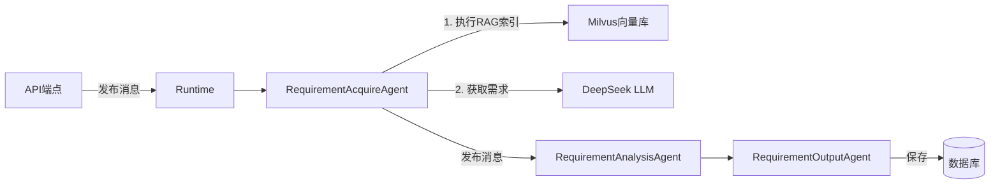

## 用户需求

用户发现日志显示"直接调用模式"，期望使用 AutoGen 0.7.5 的"Runtime模式"。

## 问题根因

Runtime 模式（`run_requirement_analysis_with_runtime`）缺少 RAG 索引步骤，之前为了支持文档向量化切换到了直接调用模式（`run_requirement_analysis`）。

## 核心目标

将完整的 RAG 索引功能集成到 Runtime 模式中，使需求分析流水线同时具备：

- AutoGen 0.7.5 标准的 Runtime 架构（消息驱动、Agent协作）
- 完整的文档向量化能力（支持后续测试用例生成的 RAG 检索）

## 技术方案

### 架构设计

采用 AutoGen 0.7.5 的 Runtime + Topic 订阅架构，在 RequirementAcquireAgent 中集成 RAG 索引：



### 核心改动

#### 1. RequirementAcquireAgent 增强（requirement_agents.py）

**当前问题**：第477-490行有 RAG 索引占位代码，但实现不完整（只有 `# ... RAG相关操作` 注释）

**改造方案**：

```python
# 在 handle_message 方法中，第477-490行之间插入完整逻辑
async def handle_message(self, message: RequirementInputMessage, ctx: MessageContext):
    task_id = message.task_id
    
    # 合并文档和描述
    combined_input = ""
    if message.document_content:
        combined_input += f"【需求文档内容】\n{message.document_content}\n\n"
    if message.description:
        combined_input += f"【需求描述】\n{message.description}"
    
    # ========== 新增：RAG 索引步骤 ==========
    if message.document_content or message.description:
        try:
            await push_log(task_id, "RAGIndexAgent", "⏳ 正在创建文档向量索引...", "thinking")
            
            from app.rag import get_index_manager
            index_manager = await get_index_manager()
            
            rag_content = message.document_content if message.document_content else message.description
            index_result = await index_manager.index_requirement_document(
                project_id=message.project_id,
                task_id=task_id,  # 支持无项目情况
                content=rag_content,
                filename="requirement_document.md",
                version_id=message.version_id,
                requirement_name=message.requirement_name,
                chunk_size=500,
                overlap=100
            )
            
            if index_result.get("success"):
                chunk_count = index_result.get('indexed', 0)
                await push_log(
                    task_id, 
                    "RAGIndexAgent", 
                    f"✅ 文档索引完成：{chunk_count} 个文本块已存入向量数据库", 
                    "response"
                )
            else:
                await push_log(
                    task_id, 
                    "RAGIndexAgent", 
                    f"⚠️ 文档索引跳过：{index_result.get('error', '未知错误')}", 
                    "thinking"
                )
        except Exception as e:
            logger.warning(f"RAG索引失败（不影响需求分析）: {e}")
            await push_log(task_id, "RAGIndexAgent", f"⚠️ RAG索引失败：{e}", "thinking")
    
    # 继续原有的需求获取流程...
```

**关键点**：

- 支持无项目情况：传递 `task_id` 作为备用集合标识
- 异常处理：RAG 索引失败不影响主流程
- 进度推送：实时推送索引进度到前端

#### 2. API 端点切换（requirements.py）

**文件**：`backend/app/api/requirements.py`

**改动位置**：

- 第378行：单文档分析 API
- 第542行：批量分析 API

**改动内容**：

```python
# 改前（直接调用模式）
from app.agents.requirement_agents import run_requirement_analysis
saved_ids = await run_requirement_analysis(...)

# 改后（Runtime模式）
from app.agents.requirement_agents import run_requirement_analysis_with_runtime
saved_ids = await run_requirement_analysis_with_runtime(...)
```

### 技术优势

1. **架构标准**：使用 AutoGen 0.7.5 的 Runtime 架构，符合最佳实践
2. **消息驱动**：Topic 订阅机制，Agent 间松耦合
3. **功能完整**：RAG 索引 + 需求分析一体化
4. **向后兼容**：所有接口签名不变，支持有项目和无项目两种情况

### 性能考虑

- RAG 索引是同步执行的（不像直接调用模式是异步），但在 Runtime 架构下这是合理的
- 文档分块（500字/块，overlap 100）优化向量化质量
- Milvus 远程连接复用，避免重复建连

## 目录结构

```
backend/app/
├── agents/
│   ├── requirement_agents.py  # [MODIFY] RequirementAcquireAgent 增强 RAG 索引逻辑
│   └── messages.py            # 无需修改（消息类型已完备）
├── api/
│   └── requirements.py        # [MODIFY] 切换到 Runtime 模式（第378行、第542行）
└── rag/
    └── llamaindex_manager.py  # 无需修改（已支持 project_id + task_id 双标识）
```