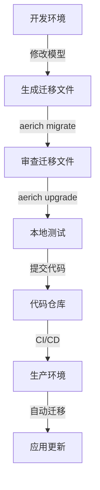

## 用户需求

修复需求分析记录模块通过 SQL 直接在数据库新增字段的问题，确保生产环境部署的安全性。

## 问题分析

当前存在以下问题：

1. **临时脚本问题**：存在 `add_requirement_name_column.py` 临时脚本，直接执行 `ALTER TABLE` 添加字段
2. **缺少迁移管理**：migrations 目录为空，没有使用 aerich 进行规范的数据库版本管理
3. **生产风险**：临时脚本不适合生产环境，无法追踪数据库变更历史，团队协作困难

## 核心功能

- 初始化 aerich 数据库迁移系统
- 生成所有数据模型的初始迁移文件
- 清理临时脚本文件
- 更新项目部署文档
- 提供生产环境迁移执行指南

## 技术栈

- **后端框架**：FastAPI + Tortoise ORM
- **数据库迁移工具**：aerich 0.8.1（已在 requirements.txt 中）
- **数据库**：MySQL 8.0+
- **配置管理**：pydantic-settings

## 实施方案

### 迁移策略

采用 aerich 迁移系统进行数据库版本管理：

1. **初始化阶段**：

- 在 backend 目录初始化 aerich
- 配置 tortoise-orm 配置文件路径
- 生成初始迁移文件

2. **迁移文件管理**：

- 所有数据库结构变更通过迁移文件管理
- 迁移文件纳入版本控制系统
- 提供清晰的迁移命令文档

3. **生产部署流程**：

- 部署前自动执行迁移
- 迁移失败自动回滚
- 保持数据库版本可追溯

### 数据模型清单

需要纳入迁移管理的模型：

- **Project**：项目表
- **ProjectVersion, VersionSnapshot**：版本管理表
- **Requirement**：功能点表（含 requirement_name 字段）
- **TestCase, TestStep**：测试用例表
- **TestPlan, TestPlanCase**：测试计划表
- **TestReport**：测试报告表
- **AsyncTask**：异步任务表

## 架构设计

### 迁移文件结构

```
backend/
├── migrations/
│   └── models/
│       ├── 0_20260318093000_init.sql  # 初始迁移文件
│       └── ...
├── pyproject.toml  # aerich 配置文件
└── app/
    └── models/  # 数据模型定义
```

### 迁移执行流程



## 目录结构

```
backend/
├── migrations/
│   └── models/  # [NEW] aerich 迁移文件目录
│       └── 0_*.sql  # [NEW] 初始迁移文件
├── pyproject.toml  # [NEW] aerich 配置文件
├── add_requirement_name_column.py  # [DELETE] 删除临时脚本
├── app/
│   └── models/  # 现有模型文件（无需修改）
└── README.md  # [UPDATE] 更新部署文档
```

## 实施注意事项

### 性能考虑

- 迁移执行时数据库会锁定，应在低峰期执行
- 对于大表的结构变更，可能需要分批执行
- 初始迁移包含所有表结构，执行时间可控

### 数据安全

- 生产环境迁移前必须备份数据库
- 迁移文件执行前应进行代码审查
- 提供迁移回滚方案

### 团队协作

- 所有迁移文件纳入 Git 版本控制
- 迁移文件命名使用时间戳，避免冲突
- 团队成员同步代码后执行 aerich upgrade

## Agent Extensions

### SubAgent

- **code-explorer**
- Purpose: 深入探索代码库中的数据库模型定义和现有迁移配置
- Expected outcome: 确认所有数据模型定义正确，了解现有数据库连接配置